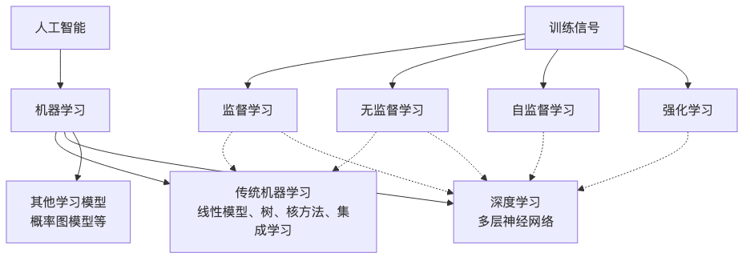
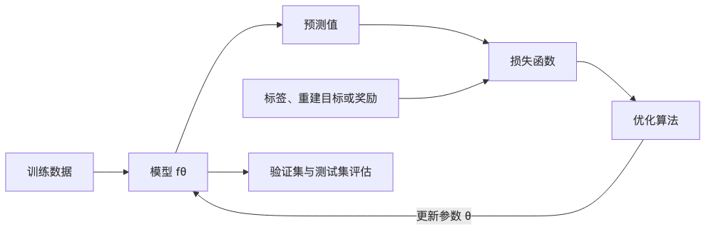

# 机器学习与深度学习：实现原理、问题类型与训练方式

机器学习(Machine Learning, ML)让程序从数据中估计规则。深度学习(Deep Learning, DL)把这条思路推进了一步：它用多层神经网络同时学习特征和任务映射。两者共享同一套学习框架，差异主要出现在模型结构、特征来源、优化方式、数据规模和计算成本上。

## 概念关系

深度学习是机器学习的一个分支，不是与机器学习并列的另一套技术。日常讨论中的「机器学习与深度学习」通常是在比较传统机器学习方法和深度神经网络。



这张图包含两个不同维度：

- 线性模型、树模型、核方法和神经网络是**模型家族**。
- 监督、无监督、自监督和强化学习是**训练信号的来源**。

神经网络可以做监督学习，也可以做自监督学习或强化学习。聚类、主成分分析等传统方法通常做无监督学习，树模型则多用于监督学习。不能把「深度学习」和「无监督学习」当作同一层级的选项。

## 机器学习的统一实现框架

无论最终用逻辑回归、随机森林还是 Transformer，训练系统通常都能拆成五个部分：

1. **数据**：样本来自什么总体，输入和目标如何表示。
2. **模型**：用带参数的函数 $f_\theta$ 表示输入到输出的映射。
3. **目标函数**：定义预测错在哪里，以及错多少。
4. **优化算法**：寻找使目标函数尽量小的参数 $\theta$。
5. **泛化评估**：确认模型在未参与训练的数据上仍然有效。

对有标签数据集 $D=\{(x_i, y_i)\}_{i=1}^n$，常见训练目标是经验风险最小化：

$$
\theta^*=\arg\min_\theta
\frac{1}{n}\sum_{i=1}^{n}L(f_\theta(x_i),y_i)
+\lambda R(\theta)
$$

$L$ 是损失函数，衡量预测与目标的偏差；$R$ 是正则项，限制模型复杂度；$\lambda$ 控制拟合训练数据和约束模型之间的权衡。

模型用一组参数压低训练误差，同时还要对新数据有效。训练集误差很低而测试集误差很高，称为**过拟合**；训练集本身都拟合不好，常见原因是模型表达能力不足、特征不够或优化没有做好。



不同学习方法改变的是这条环路中的某一部分。树模型改变函数表示和搜索办法，神经网络改变函数结构并用反向传播计算梯度，自监督学习改变目标的产生方式，强化学习则让目标来自与环境交互后的延迟奖励。

## 传统机器学习如何实现

传统机器学习没有统一的单一算法。它是一组模型家族，训练方法可能是解析求解、凸优化、贪心搜索或逐步构建集成模型。

### 线性模型在固定特征上拟合边界

线性回归用

$$
\hat y=w^Tx+b
$$

预测连续值，常用均方误差训练。逻辑回归在同一个线性打分外套一层 Sigmoid 函数：

$$
p(y=1\mid x)=\sigma(w^Tx+b)
$$

再用交叉熵衡量概率预测。输入中的每一列通常由人或上游程序定义，比如房屋面积、楼层、地理编码、近 30 天交易次数。

线性模型的优点是训练快、参数含义相对直观、对中小规模表格数据很实用。它只能直接表达输入特征的线性组合，遇到复杂关系时需要加入交叉项、分箱、对数变换等人工特征。

### 支持向量机寻找间隔最大的分界面

支持向量机的英文是 Support Vector Machine，简称 SVM。它寻找能把不同类别分开的超平面，并让最靠近边界的样本到边界的间隔尽量大。[Cortes 和 Vapnik 的原始论文](https://doi.org/10.1007/BF00994018)把方法扩展到了不可线性分割的数据；核函数还能把输入间的相似度等价地映射到高维特征空间。

它适合样本量不大、特征维度较高的分类和回归问题。训练通常是带约束的凸优化，得到的是全局最优解。核方法在样本很多时会面临计算和内存开销，输入特征的尺度也会明显影响结果。

### 决策树用贪心搜索切分数据

决策树反复寻找一个特征和阈值，把样本切成更纯的子集。分类树常比较基尼不纯度或信息增益，回归树常比较切分后的平方误差。

单棵树容易受训练数据扰动影响。随机森林用两种随机性降低方差：每棵树只看训练数据的自助采样，每个节点只从随机特征子集中选择切分。分类时多棵树投票，回归时取平均。[Breiman 的论文](https://doi.org/10.1023/A:1010933404324)把泛化表现与单棵树强度、树之间的相关性联系起来：树要有预测力，同时不能都犯相同的错。

### 梯度提升逐棵修正当前模型

随机森林可以并行训练许多独立树。梯度提升树依次加入新树，让新树拟合当前模型在目标函数上的负梯度。模型可以写成加法形式：

$$
F_M(x)=\sum_{m=1}^{M}\eta h_m(x)
$$

$h_m$ 是第 $m$ 棵树，$\eta$ 是学习率。[XGBoost](https://arxiv.org/abs/1603.02754) 在这套框架里加入正则化、二阶梯度近似、稀疏数据处理、近似分位点切分和系统级并行优化。

随机森林主要靠平均许多低相关树来降方差，梯度提升则让后加入的树持续纠正现有模型的误差。后者通常更需要调学习率、树深、树数和正则化强度。

## 深度学习如何实现

深度神经网络把很多可微的计算层串起来。每一层把上一层的表示变换为新的表示：

$$
h^{(l)}=\phi(W^{(l)}h^{(l-1)}+b^{(l)})
$$

$W^{(l)}$ 和 $b^{(l)}$ 是第 $l$ 层参数，$\phi$ 是非线性激活函数。没有非线性时，多层线性变换仍然等价于一层线性变换，深度不会增加表达能力。

### 前向传播计算预测

输入经过各层得到输出，这个过程称为前向传播。图像分类网络可能把像素逐层变成边缘、纹理、局部形状和类别打分；语言模型把离散词元变成向量，再根据上下文计算下一个词元的概率。

这些层级解释是常见观察，不应理解成每个神经元都对应一个能被人命名的概念。网络学习的是分布式表示，一个概念可能由许多单元共同编码，一个单元也可能参与多个模式。

### 反向传播计算每个参数的责任

损失函数给出最终输出错了多少。反向传播根据链式法则，从输出层向输入层计算损失对每个参数的偏导数：

$$
\frac{\partial L}{\partial W^{(l)}}=
\frac{\partial L}{\partial h^{(l)}}
\frac{\partial h^{(l)}}{\partial W^{(l)}}
$$

[Rumelhart、Hinton 和 Williams 在 1986 年的论文](https://www.nature.com/articles/323533a0)中展示了误差反向传播如何让隐藏单元学到任务内部结构。反向传播本身只负责高效求梯度，不负责决定参数怎么更新。

### 优化器更新参数

最基本的随机梯度下降，英文 Stochastic Gradient Descent，简称 SGD，更新为：

$$
\theta_{t+1}=\theta_t-\eta\nabla_\theta L_t
$$

实际训练通常把数据分成小批次，在每批数据上做前向传播、计算损失、反向传播和参数更新。[Adam](https://arxiv.org/abs/1412.6980) 为每个参数维护梯度的一阶矩和二阶矩估计，自动调整更新尺度。优化器影响收敛速度和最终解，但不能补救错误标签、数据泄漏或目标函数与真实需求不一致。

```python
for inputs, targets in train_loader:
    predictions = model(inputs)       # 前向传播
    loss = loss_fn(predictions, targets)

    optimizer.zero_grad()             # 清除上一批梯度
    loss.backward()                   # 反向传播
    optimizer.step()                  # 更新参数
```

### 深层网络为什么能学到特征

传统流水线常把特征提取与预测分开：先把图片变成人工设计的描述子，再训练分类器。深度网络把特征提取器也写成带参数的可微计算，任务损失可以沿整条链路传回去。

[AlexNet](https://proceedings.neurips.cc/paper/2012/hash/c399862d3b9d6b76c8436e924a68c45b-Abstract.html) 直接在大规模图像上训练深卷积网络，展示了数据、GPU 计算、卷积结构和正则化结合后的效果。[ResNet](https://arxiv.org/abs/1512.03385) 通过残差连接学习 $F(x)+x$，让梯度能沿较短路径传播，使更深的网络更容易优化。

「深度学习自动学习特征」也有边界。网络结构仍然包含人工选择的归纳偏置：卷积假设局部模式可复用，循环网络按顺序处理状态，Transformer 用注意力直接建立词元间关系，图神经网络按邻接关系聚合信息。数据清洗、输入表示、增强策略和目标设计同样属于工程设计。

### 常见网络结构对应不同数据关系

| 结构 | 核心计算 | 适合的数据关系 | 常见任务 |
| --- | --- | --- | --- |
| 多层感知机 MLP | 全连接层 | 固定长度向量 | 表格预测、通用函数拟合 |
| 卷积神经网络 CNN | 局部卷积与权重共享 | 空间局部性 | 图像分类、检测、分割、语音频谱 |
| 循环神经网络 RNN | 递归更新隐藏状态 | 有顺序的序列 | 时间序列、早期语言与语音系统 |
| Transformer | 自注意力与前馈层 | 长距离依赖、可并行序列 | 文本、图像、语音、多模态 |
| 图神经网络 GNN | 邻居消息聚合 | 不规则图结构 | 分子、推荐、关系网络 |

[Transformer](https://arxiv.org/abs/1706.03762) 的自注意力为每个位置计算查询、键和值：

$$
\operatorname{Attention}(Q, K, V)=
\operatorname{softmax}\left(\frac{QK^T}{\sqrt{d_k}}\right)V
$$

它能让任意两个位置直接交互，训练时也比逐步递归的序列模型更容易并行。代价是标准注意力的时间和显存开销随序列长度近似二次增长。

## 它们解决哪些问题

### 监督学习：有标准答案的预测

监督学习的数据包含输入 $x$ 和目标 $y$，适合回答「这个样本属于什么类别」或「它的数值是多少」。

| 问题 | 输出 | 例子 | 常用指标 |
| --- | --- | --- | --- |
| 分类 | 离散类别或类别概率 | 垃圾邮件识别、疾病筛查、缺陷检测 | 准确率、精确率、召回率、F1、AUC |
| 回归 | 连续数值 | 需求预测、价格估计、剩余寿命预测 | MAE、MSE、RMSE、$R^2$ |
| 排序 | 样本次序 | 搜索结果、推荐候选排序 | NDCG、MAP、MRR |
| 结构化预测 | 序列、区域或图 | 翻译、语音识别、图像分割 | BLEU、词错误率、IoU 等 |

表格数据上的分类和回归经常从逻辑回归、随机森林或梯度提升树开始。图像、语音、长文本等高维非结构化数据通常更适合深度网络，因为模型需要同时学习表示与预测规则。

### 无监督学习：没有标签时寻找结构

无监督学习只给输入 $x$，常见目标包括：

- **聚类**：把相似样本分组，用于客户分群、文档归类和探索性分析。
- **降维与表示学习**：把高维数据压到较低维，用于可视化、压缩或下游建模。
- **密度估计与生成**：学习数据分布，以便生成样本或评估样本是否异常。
- **异常检测**：识别偏离常见模式的数据点。

无监督方法找到的是与目标函数一致的结构，不保证等同于业务上想要的类别。聚类结果需要结合稳定性、可解释性和业务用途验证。

### 自监督学习：从数据本身制造训练目标

自监督学习不依赖人工逐条标注，而是从输入内部构造目标。[BERT](https://arxiv.org/abs/1810.04805) 随机遮住部分词元，再根据左右上下文预测被遮住的内容；[SimCLR](https://arxiv.org/abs/2002.05709) 对同一张图像做两种随机增强，让对应视图的表示接近、不同图像的表示分开。

大规模预训练先学通用表示，再通过微调、线性探测或提示等方式适配下游任务。自监督学习常被归入广义无监督学习，但现代论文和工程实践经常单独列出，因为它有明确的、由数据自动生成的监督目标。这是术语口径差异，不是算法事实冲突。

### 强化学习：从行动后果中学习策略

强化学习面对的是连续决策。智能体观察状态 $s_t$，选择动作 $a_t$，环境返回新状态和奖励 $r_t$。目标是最大化折扣累计回报：

$$
G_t=\sum_{k=0}^{\infty}\gamma^k r_{t+k}
$$

它适合控制、机器人、游戏、资源调度和需要多步规划的问题。[DQN](https://www.nature.com/articles/nature14236) 用卷积网络从游戏画面估计动作价值，把表示学习和 Q-learning 结合起来；[AlphaGo Zero](https://www.nature.com/articles/nature24270) 通过自我对弈产生经验，用策略/价值网络与蒙特卡洛树搜索互相改进。

强化学习训练比普通监督学习更不稳定，原因包括数据分布随策略变化、奖励可能延迟、探索会产生低质量或危险动作、相邻样本高度相关。经验回放、目标网络、策略约束、仿真环境和离线数据都是为这些问题服务的。

### 生成学习：学习数据分布并产生新样本

生成模型不只预测类别，还尝试表示 $p(x)$ 或条件分布 $p(x\mid c)$。它们用于图像、文本、音频生成，也用于数据补全、去噪、超分辨率和候选设计。

扩散模型从逐步加噪得到的简单分布出发，学习逆向去噪过程。[DDPM](https://arxiv.org/abs/2006.11239) 的训练可以写成预测噪声的监督目标，生成时则需要多步迭代采样。它通常能稳定训练并生成高质量样本，但采样成本比一次前向传播高。

生成结果看起来合理，不等于事实正确。内容生成还需要来源约束、事实核验、安全评估和版权边界。

## 传统机器学习与深度学习的训练差异

二者都在用数据调整参数，参数规模、表示方式和搜索方法有明显差别。

| 维度 | 传统机器学习的常见做法 | 深度学习的常见做法 |
| --- | --- | --- |
| 输入表示 | 人工定义特征、统计聚合、类别编码 | 尽量从原始或轻度处理的数据学习表示 |
| 参数规模 | 从几十到数百万不等 | 常见为数百万到数千亿 |
| 优化方式 | 解析解、凸优化、贪心切分、逐步加树 | 反向传播配合 SGD、Adam 等一阶优化器 |
| 数据读取 | 许多方法可整批放入内存 | 多用小批次迭代和数据流水线 |
| 计算硬件 | CPU 通常足够 | 大训练常依赖 GPU、TPU 或其他加速器 |
| 数据需求 | 中小数据上常有竞争力 | 通常更依赖大数据，也可借预训练降低标注需求 |
| 调参重点 | 特征、正则化、树深、树数、核参数 | 架构、学习率、批大小、优化器、初始化和训练步数 |
| 可解释性 | 线性系数和浅树较直接，集成模型也会变复杂 | 内部表示分布式，通常需要额外解释工具 |
| 训练成本 | 从秒到小时较常见 | 从分钟到数月都有，成本跨度很大 |
| 迁移方式 | 复用特征和少量模型参数 | 预训练模型、微调、冻结骨干网络、参数高效适配 |

表中的差异是常见工程模式，不是定义。大规模梯度提升也会消耗很多计算，线性模型可以用小批次 SGD，深度模型也能在小数据上借助预训练工作。特征工程与表示学习是一条连续谱。

### 数据划分与评估没有本质区别

两类方法都需要把数据分为训练集、验证集和测试集：

- 训练集用于更新参数。
- 验证集用于选择模型、超参数和停止时机。
- 测试集只用于最后一次无偏评估。

时间序列应按时间切分，用户行为数据常按用户或会话分组切分，医学数据可能要按患者或机构切分。若同一实体的近似样本同时进入训练集和测试集，指标会因数据泄漏而虚高。模型越复杂，这个问题越容易被高拟合能力掩盖。

### 传统方法通常把流水线分段训练

一个表格分类系统可能依次完成缺失值处理、类别编码、特征缩放、特征构造和分类器训练。每个步骤的规则通常较明确，可以单独检查。

树模型不需要特征缩放，却仍依赖正确的缺失值语义、时间窗口、类别处理和防泄漏设计。「传统机器学习依赖特征工程」是指任务知识常以输入列和统计口径进入模型，并不要求手工发明大量特征。

### 深度网络多采用端到端迭代训练

端到端训练让同一个任务损失同时调整特征提取器和输出层。完整流程常包含：

1. 初始化参数，建立可复现的数据加载与随机种子策略。
2. 按小批次执行前向传播、损失计算、反向传播和参数更新。
3. 在验证集上监控目标指标，保存检查点并决定是否早停。
4. 调整学习率、权重衰减、数据增强和模型容量。
5. 用独立测试集评估，并按数据切片检查偏差和失效场景。

深度网络的目标函数往往是高度非凸的，不保证找到全局最优解。实践关注的是能否稳定找到泛化好的解。残差连接、归一化、合理初始化、学习率调度和正则化都在改善这件事。

### 预训练改变了数据与训练成本的分配

BERT 先在大规模无标签文本上预训练，再用较少的任务标签微调。此后很多深度学习系统沿用「大规模通用预训练 + 小规模任务适配」的路线。

预训练降低了单个下游任务的标注量和训练时间，但没有消除成本，而是把成本集中到基础模型阶段。预训练数据的偏差、许可证、时间范围和隐私问题也会被带到下游模型。

## 用同一个问题比较两条实现路线

假设任务是判断一条电商交易是否存在欺诈。

### 传统机器学习路线

输入通常是结构化特征：金额、设备类型、账户年龄、过去 24 小时交易次数、收货地变化、商户风险分等。可以先训练逻辑回归建立基线，再尝试梯度提升树。

训练重点在时间窗口是否正确、类别极不平衡时怎样设置权重、特征是否泄漏未来信息、概率是否校准。模型输出可以较容易地和具体输入列联系起来，CPU 上的迭代也较快。

### 深度学习路线

若输入还包括很长的行为序列、设备指纹、商品文本、关系网络和图片，深度模型可以分别编码这些原始信号，再联合训练。序列编码器学习交易顺序，图神经网络聚合账户与设备关系，文本或图像编码器处理非结构化内容。

这条路线需要更多数据、算力和线上监控。标签延迟、概念漂移、推理延迟及模型校准都要单独处理。若可用数据只有几万行规整表格，直接上深度网络未必比梯度提升树更好。

### 选择取决于数据关系和交付约束

可以按以下顺序判断：

1. 输出是分类、回归、生成还是连续决策。
2. 数据是表格、图像、文本、序列还是图结构。
3. 有多少可靠标签，能否利用无标签数据或预训练模型。
4. 训练预算、推理延迟、内存和部署环境有多严格。
5. 是否需要解释单次决策，错误的业务代价是什么。
6. 数据分布会不会快速变化，模型如何监控和更新。

规整表格、中小数据和严格解释要求通常先试线性模型或梯度提升树。图像、语音、长文本、多模态和大规模序列通常先看深度学习。连续行动且反馈来自环境时，再考虑强化学习；如果历史数据已经能把每个动作标成标准答案，监督学习往往更简单、更稳定。

## 常见误区

### 深度学习不会取代所有传统模型

深度网络在非结构化数据和大规模预训练上优势明显。表格数据、低延迟服务、小样本、强解释约束和边缘设备等场景仍常用传统方法。工程上也会组合两者，比如用深度网络提取图像向量，再把向量和表格特征交给树模型。

### 模型更深不保证结果更好

模型容量增加后，数据量、优化难度、过拟合风险和推理成本都会变化。ResNet 解决了深层网络难优化的一部分问题，并不意味着层数可以不受约束地增加。验证集表现和真实业务指标比网络层数更重要。

### 无标签不等于没有监督信号

BERT 的遮盖词预测和 SimCLR 的对比目标都有明确答案，只是答案由数据变换自动产生。强化学习也有奖励信号，只是奖励不一定逐步给出正确动作。

### 训练损失低不等于解决了问题

损失函数只是业务目标的代理。一个欺诈模型可能通过拒绝大量正常交易提高召回率，却损害用户体验。训练时应同时定义主指标、约束指标和不同人群或场景的切片指标。

### 深度学习不是完全自动化的特征工程

网络会学习中间表示，但数据采样、架构、目标函数、增强、词元化、上下文长度和输出约束仍由人设计。人工设计从单个特征移到了数据与训练系统层面。

### 相关性预测不自动带来因果结论

大多数监督学习模型估计观察数据中的统计关联。模型能准确预测某类用户流失，不代表改变某个高权重特征就能阻止流失。因果问题需要实验、自然实验或明确的因果假设。

## 最小实践路径

学习时可以用一个公开的小型数据集完成两次实现：

1. 用逻辑回归或梯度提升树建立基线，记录特征处理、交叉验证和测试指标。
2. 用一个小型多层感知机处理同一数据，记录批大小、学习率、训练曲线和早停位置。
3. 固定同一数据切分和指标，比较训练时间、参数量、错误样本、校准情况与推理成本。
4. 再换到图像或文本数据，观察深度网络在表示学习上的优势为何变得明显。

比较时应关注数据表示、模型假设和训练成本如何共同决定结果，不必预设神经网络一定会赢。

## 速查结论

| 问题 | 简短回答 |
| --- | --- |
| 机器学习的实现原理是什么 | 选定模型、损失和约束，用数据估计参数，并在未见数据上验证泛化 |
| 深度学习的实现原理是什么 | 用多层可微网络做前向计算，通过反向传播求梯度，再用优化器迭代更新大量参数 |
| 两者最重要的工程差异是什么 | 传统方法常在人工定义的特征上学习，深度网络通常端到端学习特征与任务映射 |
| 传统机器学习擅长什么 | 表格数据、中小样本、快速基线、低成本部署和较强解释要求 |
| 深度学习擅长什么 | 图像、语音、文本、序列、图和多模态等高维非结构化数据 |
| 监督学习解决什么 | 有标签的分类、回归、排序与结构化预测 |
| 无监督学习解决什么 | 聚类、降维、密度估计、异常检测和数据结构探索 |
| 自监督学习解决什么 | 从无人工标签的大数据中预训练可迁移的表示 |
| 强化学习解决什么 | 动作会影响未来状态、反馈延迟的连续决策 |
| 训练方式是否完全不同 | 不完全不同；都围绕数据、模型、目标、优化和泛化，只是模型结构与优化过程差别很大 |

## 参考资料

以下资料以提出关键方法的论文和作者、实验室或会议的正式页面为主。

- Rumelhart, Hinton, Williams, [Learning representations by back-propagating errors](https://www.nature.com/articles/323533a0), 1986。反向传播与隐藏表示。
- Cortes, Vapnik, [Support-vector networks](https://doi.org/10.1007/BF00994018), 1995。最大间隔与核方法。
- Breiman, [Random Forests](https://doi.org/10.1023/A:1010933404324), 2001。随机树集成、强度与相关性。
- Chen, Guestrin, [XGBoost: A Scalable Tree Boosting System](https://arxiv.org/abs/1603.02754), 2016。正则化树提升与系统优化。
- Krizhevsky, Sutskever, Hinton, [ImageNet Classification with Deep Convolutional Neural Networks](https://proceedings.neurips.cc/paper/2012/hash/c399862d3b9d6b76c8436e924a68c45b-Abstract.html), 2012。大规模卷积网络训练。
- He et al., [Deep Residual Learning for Image Recognition](https://arxiv.org/abs/1512.03385), 2015。残差连接与深层网络优化。
- Vaswani et al., [Attention Is All You Need](https://arxiv.org/abs/1706.03762), 2017。Transformer 与自注意力。
- Devlin et al., [BERT: Pre-training of Deep Bidirectional Transformers for Language Understanding](https://arxiv.org/abs/1810.04805), 2018。自监督预训练与下游微调。
- Kingma, Ba, [Adam: A Method for Stochastic Optimization](https://arxiv.org/abs/1412.6980), 2014。自适应一阶优化。
- Mnih et al., [Human-level control through deep reinforcement learning](https://www.nature.com/articles/nature14236), 2015。DQN、经验回放与目标网络。
- Silver et al., [Mastering the game of Go without human knowledge](https://www.nature.com/articles/nature24270), 2017。自我对弈、策略价值网络与树搜索。
- Chen et al., [A Simple Framework for Contrastive Learning of Visual Representations](https://arxiv.org/abs/2002.05709), 2020。对比式自监督学习。
- Ho, Jain, Abbeel, [Denoising Diffusion Probabilistic Models](https://arxiv.org/abs/2006.11239), 2020。扩散生成模型。

## 研究边界

本文讨论的是主流统计学习与深度神经网络的共同框架，没有展开贝叶斯学习、概率图模型、因果推断、联邦学习、在线学习和完整的大模型后训练流程。不同资料对「无监督学习是否包含自监督学习」口径不一，本文采用工程中常见的四分法，并明确两者的包含关系存在语境差异。
