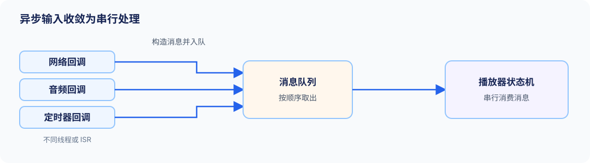
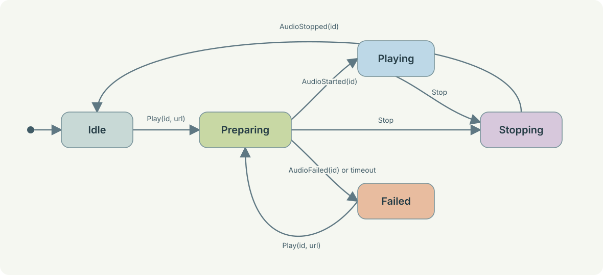
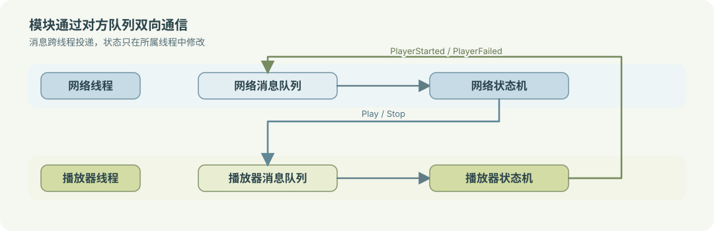

# 异步模块设计：从状态机到消息分发

网络请求、系统中断、定时器回调都会在不可预知的时刻产生输入，设备应该如何处理这些随机事件？刚开始写软件时，我只会在每个请求里直接调用目标接口。功能少时这样写很快，逻辑也很清晰。但随着需求的增加，业务执行、失败处理、错误恢复等过程会散落在不同处理接口之中，模块间的耦合性增加，代码不再能明确地展现时序关系，说明系统状态。

后来进一步学习软件设计，开始为程序加入事件驱动模式 `Event-Driven`，用消息队列和状态机来处理模块间的通讯和模块本身状态，但这也带来新的问题：

- 消息中哪些是应该被处理的命令？哪些是模块的内部事件？哪些是模块间的领域事件？
- 命令、内部事件和领域事件为什么要分开？
- 网络包、驱动回调和定时器怎样进入业务逻辑？
- 单线程事件循环怎样扩展到多线程中？
- 状态机应该怎么分层才合适？

软件架构应当有更明晰的范式。

## 1. 一个看似简单的播放需求

设备连接云端。服务端下发一条播放 URL 的命令，设备启动音频驱动；驱动准备好后开始输出音频；服务端也希望知道播放是否真正开始或失败。

最直接的实现往往类似这样：

```c
// 接收到网络包后执行
void network_rx_callback(const char *packet)
{
    if (starts_with(packet, "PLAY")) {
        player_start(parse_url(packet));
    }
}

// 音频驱动启动后执行
void audio_driver_started_callback(void)
{
    g_player.state = PLAYER_PLAYING;
    report_to_server("started");
}
```

这段代码的问题不在于函数调用本身，而在于控制权被拆散了：

- 网络回调不知道播放器正在停止时能否接受新的播放请求。
- 音频驱动可能在停止后才迟到地报告「已启动」。
- 网络线程和音频线程都可能修改播放器状态 `g_player.state`。
- 服务端收到的 `started` 无法可靠对应到某一条播放命令。

这些问题不是多加几个 `if` 就能解决。系统需要一个地方保存播放器状态，也需要一条统一路径把异步输入送到这个地方。

状态机就用于保存模块状态，消息队列就用于同步处理异步输入。

## 2. 状态机描述允许的行为

状态机关心**当前允许处理什么**。例如，播放器有 `Idle`、`Preparing`、`Playing`、`Stopping` 等状态，`Idle` 状态下仅允许处理 `Play` 消息，`Preparing` 和 `Playing` 状态下仅允许处理 `Stop` 消息等。

一个基本转换可以写成：

```text
(当前状态, 输入消息, 守卫条件) -> (下一个状态, 动作, 对外事件)
```

比如：

```text
(Preparing, AudioStarted(id), id == active_request_id)
    -> (Playing, NONE, PlayerStarted(id))
```

状态机更关键的价值是**把不允许的路径描述出来**。`Idle` 状态收到 `AudioStopped`，通常应忽略或记录诊断信息；`Stopping` 状态收到旧请求的 `AudioStarted`，不能重新进入 `Playing`。

David Harel 在 1987 年提出的 Statecharts 将传统状态图扩展为层级、并行区域和通信，用来描述复杂离散事件系统。[^1]

对于大多数软件来说，有限状态机已经够用了。状态多到难以维护时，再引入层级状态，例如把 `Connected` 拆成认证、同步和工作三个子状态。

W3C 的 SCXML (State Chart XML) 规范把状态、事件、转换和守卫条件定义为基本构件。[^2]

### 状态不是一个布尔变量集合

下面的设计容易出现矛盾组合：

```c
bool is_playing;
bool is_stopping;
bool is_preparing;
```

`is_playing` 和 `is_stopping` 能否同时为真？准备失败时三个变量分别是什么？这些问题往往被留给调用者猜测。

改为互斥状态后，系统在任意时刻都有且仅有一个明确阶段：

```c
typedef enum {
    PLAYER_IDLE,
    PLAYER_PREPARING,
    PLAYER_PLAYING,
    PLAYER_STOPPING,
    PLAYER_FAILED,
} PlayerState;
```

互斥状态不等于整个系统只有一个状态。设备既可能处于「网络在线」，又处于「正在播放」。它们属于不同模块，分别由网络状态机和播放器状态机持有。

## 3. 异步消息从哪里来

播放器不会只收到网络命令。它至少还要处理：

- 网络模块解析出的 `Play` 和 `Stop`。
- 音频驱动完成初始化后的 `AudioStarted`。
- 音频驱动失败后的 `AudioFailed`。
- 软件定时器产生的 `PrepareTimedOut`。
- 设备断网或资源被抢占后的取消请求。

这些输入可能来自不同线程，甚至来自 ISR (Interrupt Service Routine)。如果它们直接修改状态机，状态就会出现竞争。处理方式是把回调限制在边界处：回调构造消息并入队，状态机只在自己的消费上下文中运行。



逻辑上的串行处理不要求硬件真的单线程。音频 DMA (Direct Memory Access) 和网络中断仍可并发发生；它们只是在进入播放器业务逻辑前，被收敛为有顺序的输入。

## 4. 先把消息语义说清楚

「事件驱动」这个词很宽泛。实现前应先区分三种消息。

| 类型 | 表达的含义 | 接收者 | 例子 |
| :--- | :--- | :--- | :--- |
| 命令 | 请求模块执行动作 | 唯一且明确 | `Play`、`Stop`、`Connect` |
| 内部事件 | 异步操作的结果 | 状态所有者 | `AudioStarted`、`AudioFailed`、`PrepareTimedOut` |
| 领域事件 | 已发生的业务事实 | 零到多个订阅者 | `PlayerStarted`、`NetworkOnline` |

服务端下发「播放」是命令。播放器收到命令后可以接受、拒绝或延迟处理。只有音频驱动确认启动完成，播放器才能发布 `PlayerStarted`。

领域事件必须使用过去式命名。`PlayerStarted` 表示事实已经发生，日志、UI 和网络上报模块都可以订阅它，但播放器不需要等待任何订阅者回复。

不要发布 `PlayRequested`，再希望播放器一定订阅并执行。Martin Fowler 将这种把命令伪装成事件的做法称为 passive-aggressive command。它会隐藏发送方对接收方的控制依赖。[^4]

### 每条消息都需要一张契约卡

消息名称不足以表达全部规则。设计时填写下面的表：

| 字段 | 需要回答的问题 |
| :--- | :--- |
| 名称和类型 | 它是命令、内部事件还是领域事件？ |
| 发送方和接收方 | 谁产生它，谁必须处理它，谁可以观察它？ |
| 时机 | 何时发送，是否代表操作已完成？ |
| 负载 | URL、错误码、设备 ID 和时间戳分别归谁所有？ |
| 关联标识 | 如何将异步结果对应到原始请求？ |
| 顺序与重复 | 同一请求是否要求顺序，收到重复消息怎么办？ |
| 失败策略 | 目标不存在、状态不接受或队列满时怎么办？ |

播放器的 `Play` 命令与 `AudioStarted` 内部事件必须带同一个 `request_id`。播放器保存 `active_request_id`，只接受与当前请求匹配的回调。

## 5. 先把设计写成可评审的产物

在实现事件循环和状态处理器之前，至少完成以下四张表。它们比一张状态图更适合讨论边界和异常路径。

### 模块边界表

| 模块 | 它拥有的状态 | 接收的命令 | 使用的驱动端口 | 发布的领域事件 |
| :--- | :--- | :--- | :--- | :--- |
| 网络模块 | `Disconnected`、`Connecting`、`Online` | `Connect`、`Disconnect` | Wi-Fi、TCP | `NetworkOnline`、`NetworkOffline` |
| 播放器模块 | `Idle`、`Preparing`、`Playing`、`Stopping`、`Failed` | `Play`、`Stop` | AudioPort | `PlayerStarted`、`PlayerStopped`、`PlayerFailed` |

### 消息目录

| 名称 | 类型 | 发送方 | 接收方 | 关联和失败规则 |
| :--- | :--- | :--- | :--- | :--- |
| `Play` | 命令 | 网络、按键、蓝牙 | 播放器 | 带 `request_id` 和 URL。目标队列满时向发送方报告失败。 |
| `AudioStarted` | 内部事件 | 音频驱动 | 播放器 | 带原始 `request_id`。不匹配时忽略并记录。 |
| `PlayerStarted` | 领域事件 | 播放器 | 订阅者 | 只在驱动已确认启动后发布。 |

### 状态转换表

表中必须包含成功、失败、取消、超时和过期回调。没有写进表的输入仍会发生，只是发生时系统没有定义行为。

### 关键时序

为每个跨模块流程写一条正常路径和一条异常路径。例如，`Preparing` 时收到 `Stop` 后进入 `Stopping`；随后迟到的 `AudioStarted(id)` 不应把播放器带回 `Playing`，直到收到 `AudioStopped(id)` 才回到 `Idle`。

## 6. 事件循环只负责按契约送信

事件循环把消息从队列取出，按目标送到模块。它不保存播放器状态，也不推断业务流程。

```c
typedef enum {
    KIND_COMMAND,
    KIND_INTERNAL_EVENT,
    KIND_DOMAIN_EVENT,
} MessageKind;

typedef enum {
    TARGET_PLAYER,
    TARGET_NETWORK,
    TARGET_NONE,
} Target;

typedef struct {
    MessageKind kind;
    Target target;
    MessageType type;
    uint32_t request_id;
    int error_code;
    char url[128];
} Message;
```

`TARGET_PLAYER` 和 `TARGET_NETWORK` 用于命令和内部事件。领域事件没有唯一目标，路由器把它交给事件订阅者。

```c
static void event_loop_run(EventLoop *loop)
{
    Message msg;

    while (event_loop_pop(loop, &msg)) {
        if (msg.kind == KIND_DOMAIN_EVENT) {
            event_bus_publish(&msg);
        } else if (msg.target == TARGET_PLAYER) {
            player_handle(loop->player, loop, &msg);
        } else if (msg.target == TARGET_NETWORK) {
            network_handle(loop->network, loop, &msg);
        }
    }
}
```

这段路由代码不应出现 `audio_start()`、`if (player_is_busy)` 或重试策略。它只有两项机械职责：**将定向消息投递给目标模块**，或**发布已经完成的事实**。

命令和领域事件可以复用一条物理队列，但最好提供不同的 API：

```c
bool send_command(EventLoop *loop, const Message *command);
bool post_internal_event(EventLoop *loop, const Message *event);
bool publish_domain_event(EventLoop *loop, const Message *event);
```

名称不同会迫使调用者先回答「我是在要求谁做事，还是在陈述已经发生的事实」。

## 7. 用网络播放器案例落地

将前面的消息目录和状态转换表落实到播放器，先写出状态转换，再写代码。

| 当前状态 | 输入 | 守卫条件 | 下一个状态 | 动作 | 发布事件 |
| :--- | :--- | :--- | :--- | :--- | :--- |
| `Idle` | `Play(id, url)` | URL 合法 | `Preparing` | `audio.start(url, id)` | 无 |
| `Preparing` | `AudioStarted(id)` | `id == active_request_id` | `Playing` | 无 | `PlayerStarted(id)` |
| `Preparing` | `AudioFailed(id)` | `id == active_request_id` | `Failed` | 记录错误 | `PlayerFailed(id)` |
| `Preparing` | `Stop` | 无 | `Stopping` | `audio.stop(active_request_id)` | 无 |
| `Playing` | `Stop` | 无 | `Stopping` | `audio.stop(active_request_id)` | 无 |
| `Stopping` | `AudioStopped(id)` | `id == active_request_id` | `Idle` | 清空活动请求 | `PlayerStopped(id)` |

状态图将「**允许的下一步**」直观地画出来：



播放器拥有状态和活动请求。音频驱动通过一个窄接口接入，使状态机不依赖具体 SDK：

```c
typedef struct {
    void *ctx;
    void (*start)(void *ctx, const char *url, uint32_t request_id);
    void (*stop)(void *ctx, uint32_t request_id);
} AudioPort;

typedef struct {
    PlayerState state;
    uint32_t active_request_id;
    AudioPort audio;
} Player;
```

核心处理函数如下。状态先更新，再执行异步动作。驱动完成后，必须重新投递内部事件，而不是直接写 `player->state`。

```c
static void player_handle(Player *player,
                          EventLoop *loop,
                          const Message *msg)
{
    switch (player->state) {
    case PLAYER_IDLE:
        if (msg->type == MSG_PLAY) {
            player->state = PLAYER_PREPARING;
            player->active_request_id = msg->request_id;
            player->audio.start(player->audio.ctx,
                                msg->url,
                                msg->request_id);
        }
        break;

    case PLAYER_PREPARING:
        if (msg->type == MSG_AUDIO_STARTED &&
            msg->request_id == player->active_request_id) {
            player->state = PLAYER_PLAYING;
            player_publish(loop, MSG_PLAYER_STARTED,
                           player->active_request_id, 0);
        } else if (msg->type == MSG_AUDIO_FAILED &&
                   msg->request_id == player->active_request_id) {
            player->state = PLAYER_FAILED;
            player_publish(loop, MSG_PLAYER_FAILED,
                           player->active_request_id, msg->error_code);
        } else if (msg->type == MSG_STOP) {
            player->state = PLAYER_STOPPING;
            player->audio.stop(player->audio.ctx,
                               player->active_request_id);
        }
        break;

    case PLAYER_STOPPING:
        if (msg->type == MSG_AUDIO_STOPPED &&
            msg->request_id == player->active_request_id) {
            uint32_t completed_id = player->active_request_id;
            player->state = PLAYER_IDLE;
            player->active_request_id = 0;
            player_publish(loop, MSG_PLAYER_STOPPED, completed_id, 0);
        }
        break;

    default:
        break;
    }
}
```

网络模块的职责更小。它把协议包解析为 `Play` 或 `Stop` 命令，并投递给播放器；它不调用播放器的内部函数。

```c
static void network_on_packet(EventLoop *loop, const char *packet)
{
    Message command = {0};
    unsigned int request_id;
    char url[128] = {0};

    if (sscanf(packet, "PLAY %u %127s", &request_id, url) == 2) {
        command.kind = KIND_COMMAND;
        command.target = TARGET_PLAYER;
        command.type = MSG_PLAY;
        command.request_id = request_id;
        strncpy(command.url, url, sizeof(command.url) - 1);
        send_command(loop, &command);
    }
}
```

完整的播放成功路径是：

```text
网络包 PLAY(id, url)
    -> Play(id, url) 投递给播放器
    -> 播放器: Idle -> Preparing
    -> AudioPort.start(url, id)
    -> 驱动回调 AudioStarted(id) 入队
    -> 播放器: Preparing -> Playing
    -> 发布 PlayerStarted(id)
    -> 日志、UI 和网络上报模块自行订阅
```

## 8. 超时、取消、队列和错误

异步操作一定会遇到「没有回调」的情况。播放准备阶段需要定时器；定时器到期后投递 `PrepareTimedOut(id)`。这条消息与驱动成功或失败回调一样进入播放器状态机，不能在定时器回调中直接重置播放器。

多线程程序通常使用有界消息队列。Zephyr 的实现采用固定大小项目和固定容量的环形缓冲区，线程和 ISR 都可以投递。项目过大时，复制时间会增加，并可能延长中断延迟。[^5] 因此消息通常携带短数据、索引或指针，而不是把整段音频数据复制进队列。

每个队列都应定义满队列策略：

- 日志、统计和最新传感器读数可以丢弃、覆盖或合并。
- 停止、故障和安全控制消息不能静默丢弃，应预留容量、重试或进入安全状态。
- 队列操作必须检查返回值。满队列不是罕见异常，而是负载超过消费能力时的正常状态。

如果平台还存在硬件中断，普通线程和 ISR 的队列投递 API 通常不同。以 FreeRTOS 为例，`xQueueSendFromISR` 用于 ISR 上下文。[^6] 无论使用哪一种队列实现，ISR 都应只采集最少数据并投递消息，不分配内存、不等待锁、不运行状态机。Zephyr 的 work queue 文档也展示了由 ISR 将工作卸载给工作线程的模式。[^7]

## 9. 扩展到多线程

单线程事件循环已经给出一条约束：**状态只能由所属的消费上下文修改**。模块需要独立优先级、可能等待 I/O，或需要隔离状态时，可以把这条约束部署到多个线程。先明确状态所属的并发单元，再决定是否为它分配独立线程。

### 活动对象：把状态所有权落实到执行上下文

活动对象，即 Active Object，是把**私有状态、事件队列、事件处理器和执行上下文**组合在一起的并发单元。其他组件不能直接读写它的私有状态，只能向它的队列异步投递事件；对象在自己的执行上下文中逐个取出并处理事件。[^3] 它以消息传递避免跨线程共享状态，而不依赖调用方给普通对象加锁。

这里采用的是与本文事件队列和状态机相匹配的事件驱动形式。通用的 Active Object 模式还可以通过代理、激活队列、调度器和 Future 将请求发起与实际执行解耦；无论采用何种实现，调用方都不应在自己的线程中直接执行对象请求。[^9]

| 构件 | 约束 | 播放器中的对应物 |
| :--- | :--- | :--- |
| 私有状态 | 仅状态所有者读写 | `state`、`active_request_id` 和 `AudioPort` |
| 事件队列 | 可以有多个生产者，但只由对象本身消费 | 网络、音频和定时器回调投递的 `Message` |
| 事件处理器 | 一次处理一条事件，处理完成后再取下一条 | `player_handle()` |
| 执行上下文 | 负责从队列取消息并调用处理器 | 播放器线程，或统一事件循环中的播放器调度步骤 |

对于本文所描述的播放器，只有同时满足以下条件，才真正具备活动对象的边界：网络线程、驱动回调和其他模块都不能直接写 `Player`；播放器队列的唯一消费者调用 `player_handle()`；与网络、驱动和 UI 的交互都通过命令、内部事件或领域事件完成。这样，`AudioStarted(id)` 与 `Stop` 即使并发到达，也会在播放器内部变成可定义先后的两次处理，而不是两个线程同时修改 `state`。

### 多线程只改变部署方式

当网络和播放器需要独立优先级或隔离时，可以分别为这两个活动对象配置线程和私有队列。



通信仍然只能经过对方的队列，其他线程不能直接修改工作线程的私有数据。单线程事件循环和双线程部署遵循相同的状态所有权与消息契约。

### 一次事件必须处理完再取下一条

活动对象通常采用 run-to-completion(RTC) 语义：当前事件引起的状态转换和同步动作必须完成，才能处理队列中的下一条事件。RTC 不等于线程不能被操作系统或中断抢占；它约束的是同一个对象不会在上一条事件尚未完成时开始处理下一条事件。[^8]

因此，活动对象的事件处理器不能在中间阻塞等待网络、驱动或锁。需要等待的操作应先发起异步请求并立即返回，由完成回调、超时或取消消息来驱动下一次 RTC 步骤；耗时计算则应拆成后续消息，或交给独立工作线程后再投递结果。否则队列继续积压，播放器会对 `Stop`、故障和超时失去响应。[^8]

活动对象也不会自动解决队列满、过期回调或共享硬件资源。前两者仍要依赖本节的容量、关联标识和失败策略；若多个活动对象必须使用同一硬件，则应让一个对象成为该资源的唯一管理者，其他对象以事件请求服务，而不是绕过边界直接访问。[^3]

### 线程数由隔离需求决定

活动对象不要求每个模块各占一个线程。状态机很小、动作短且不阻塞时，多个对象可以放在同一个事件循环；模块需要独立优先级、可能等待 I/O，或需要明显隔离时，再使用独立线程和线程安全消息队列。

多线程下消息到达顺序仍是设计的一部分。可以依赖同一队列的顺序，但不能假设不同队列之间存在全局时间顺序。跨模块结果要通过 `request_id`、序列号或版本号关联。

## 10. 从设计产物生成测试

状态转换表可以直接生成状态机单元测试。测试不必先启动真实网络和声卡。

| 场景 | 输入 | 期望结果 |
| :--- | :--- | :--- |
| 正常播放 | `Idle + Play` | 状态变为 `Preparing`，fake AudioPort 收到 `start`。 |
| 真正开始 | `Preparing + AudioStarted(匹配 id)` | 状态变为 `Playing`，发布 `PlayerStarted`。 |
| 迟到回调 | `Stopping + AudioStarted(旧 id)` | 状态保持 `Stopping`。 |
| 停止完成 | `Stopping + AudioStopped(匹配 id)` | 状态变为 `Idle`，发布 `PlayerStopped`。 |
| 准备超时 | `Preparing + PrepareTimedOut(匹配 id)` | 进入失败或停止路径，并发布可观察的失败结果。 |
| 队列满 | 投递控制消息失败 | 执行设计中定义的重试、报警或安全状态策略。 |

为 `AudioPort` 提供 fake 实现即可测试状态机：fake 记录 `start` 和 `stop` 调用，测试代码手动投递 `AudioStarted`、`AudioStopped` 和 `AudioFailed`。真实驱动只需要验证它是否正确把硬件回调转换为内部事件。

消息目录和关键时序还可生成路由与集成测试：命令只能抵达唯一处理者，领域事件可以被多个订阅者观察；跨线程消息通过同一个 `request_id` 关联；控制消息投递失败时，系统执行设计中定义的重试、报警或安全状态策略。

## 附录 A：最小可运行的 C 示例

完整代码已按职责拆分为多个 C 源文件，文件索引、依赖关系和编译命令请见 [示例 README.md](./assets/code/异步模块设计/README.md)。可从 [main.c](./assets/code/异步模块设计/main.c) 查看一轮完整的「网络命令 → 播放器状态机 → 驱动回调 → 领域事件」流程。

## 附录 B：设计前检查清单

- 每个状态是否有唯一所有者？
- 每条命令是否有唯一处理者？
- 每个异步调用是否定义了成功、失败、取消和超时结果？
- 每条驱动回调是否携带原始 `request_id`？
- 每个领域事件是否代表已经发生的事实？
- 路由器、网络回调和驱动回调是否没有直接修改业务状态？
- 队列满时，控制和故障消息是否有明确策略？
- 迟到、重复和乱序消息是否在状态表中定义了处理方式？
- 每一条状态转换是否有测试？

## References

1. [^1]: David Harel, [Statecharts: A Visual Formalism for Complex Systems](https://www.state-machine.com/doc/Harel87.pdf), 1987。说明状态图为何需要层级、并行和通信。
2. [^2]: W3C, [SCXML](https://www.w3.org/TR/scxml/)。定义状态、事件、守卫条件与 run-to-completion 语义。
3. [^3]: Quantum Leaps, [Active Object](https://www.state-machine.com/active-object)。说明私有状态、事件队列、异步通信与一次处理一个事件的并发模型。
4. [^4]: Martin Fowler, [What do you mean by 「Event-Driven」?](https://martinfowler.com/articles/201701-event-driven.html), 2017。区分事件通知、命令和事件溯源，避免混用这些概念。
5. [^5]: Zephyr Project, [Message Queues](https://docs.zephyrproject.org/latest/kernel/services/data_passing/message_queues.html)。说明固定容量消息队列以及线程与 ISR 投递的运行时约束。
6. [^6]: FreeRTOS, [Queue Management](https://freertos.org/Documentation/02-Kernel/04-API-references/06-Queues/00-QueueManagement)。说明线程与 ISR 队列 API 的边界。
7. [^7]: Zephyr Project, [Workqueue Threads](https://docs.zephyrproject.org/latest/kernel/services/threads/workqueue.html)。展示由 ISR 将工作卸载到工作线程的模式。
8. [^8]: Quantum Leaps, [Conceptual Model of QP/C++](https://www.state-machine.com/qpcpp/conc-qp.html)。说明活动对象的 RTC、非阻塞处理、单消费者事件队列与执行上下文。
9. [^9]: R. Greg Lavender and Douglas C. Schmidt, [Active Object: An Object Behavioral Pattern for Concurrent Programming](https://www.cs.wm.edu/~dcschmidt/PDF/Active-Objects.pdf), *Pattern Languages of Program Design 2*, Addison-Wesley, 1996。定义请求发起与实际执行的解耦，以及 Activation Queue、Scheduler 和 Future 等构件。
