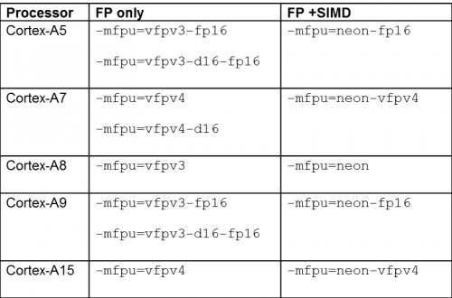

# Arm Cortex-A Processors and GCC Command Lines

CPU, floating point and SIMD (Single Instruction, Multiple Data) acceleration

## What options should I use for my CPU?

The key options for telling the compiler about the CPU information

- ` -mcpu=<cpu-name> `

For example, for the Cortex-A9, the option is `-mcpu=cortex-a9`

GCC currently supports all Cortex-A processors up to, and including the Cortex-A15; that is:

```makefile
Cortex-A5 -mcpu=cortex-a5
Cortex-A7 -mcpu=cortex-a7
Cortex-A8 -mcpu=cortex-a8
Cortex-A9 -mcpu=cortex-a9
Cortex-A15 -mcpu=cortex-a15
```

If you don't specify the CPU to use, GCC will use its built-in default -- that can vary depending on how the compiler was originally built and it may mean that the code generated will execute quite slowly (or not at all) on the CPU that you have.

## Adding floating-point and SIMD

All Arm Cortex-A processors available today come with a floating-point unit and most also have a SIMD unit that implements the Arm Advanced-SIMD processor extensions (commonly known as [NEON](https://developer.arm.com/technologies/neon)).

However, the precise set of instructions available depends on the processor that you have and GCC requires a separate option to control this; it doesn't try to work it out from the `-mcpu` option. The choice of **floating-point** and **SIMD** instructions is controlled by the option **`–mfpu`** and the recommended choices for each of the CPUs are given in the table below:



- VFPv3 and VFPv4 implementations start with **32 double-precision registers**
- When NEON is NOT present, the top 16 registers become optional; this is controlled by the d16 component of the option name
- The fp16 component of the name specifies the presence of half-precision (16-bit) floating-point load, store and conversion instructions; this is an extension to VFPv3 but available in all VFPv4 implementations

 The option `-mfloat-abi` takes three possible options:

1. `-mfloat-abi=soft` --> **ignore** all FPU and NEON instructions, use only the **core register set** and emulate all floating-point operations using **library calls**
2. `-mfloat-abi=softfp` --> use the same calling conventions as `-float-abi=soft`, but use floating-point and NEON instructions **as appropriate**. *This option is binary compatible with `-mfloat-abi=soft`* and can be used to improve the performance of code that has to conform to a soft-float environment but where it is known that the relevant hardware instructions will be available.
3. `-mfloat-abi=hard` --> use the floating-point and NEON instructions **as appropriate** and also change the [ABI calling conventions](http://infocenter.arm.com/help/topic/com.arm.doc.ihi0042-/index.html) in order to generate more efficient function calls; floating-point and vector types can now be passed between functions in the extension registers which not only saves a significant amount of copying but also means that fewer calls need to pass arguments on the stack.
