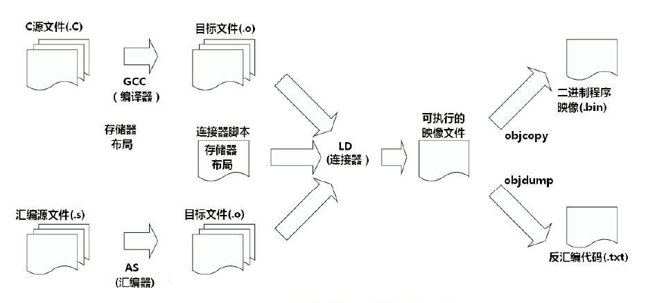

# 交叉编译

## 简介

**本地编译：**
程序的编译发生在运行程序的平台上（或是程序编译机器和运行机器属于同一体系结构），且编译结果只能运行于当前平台。

比如，在 x86 平台上，编写程序并编译成可执行程序。这种方式下，我们使用 x86 平台上的编译工具，开发针对 x86 平台本身的可执行程序，这个编译过程称为本地编译。

**交叉编译：**
在开发平台上编译出能够在目标平台运行的可执行文件。

编译程序的机器和运行程序的机器属于不同的体系结构。在编译平台下，通过交叉编译，编译结果可在目标平台上运行，但在编译平台不可以运行。

比如，在 x86 平台上，编写程序并编译成能运行在 ARM 平台的程序，编译得到的程序在 x86 平台上是不能运行的，必须放到 ARM 平台上才能运行。

**编译工具链：**
将源代码编译成机器码所用的工具集叫做工具链

## 编译链

首先编译过程是按照不同的子功能，依照先后顺序组成的一个复杂的流程，如下图：



### 编译过程

1. 预处理(Pre-Process) —> `.i file`

```bash
# -E 选项 告诉编译器仅对输入文件进行预处理
# 预处理结果的缺省拓展名为 .i
gcc -E test.c -o test.i  
```

C/C++源文件中，以`#`开头的命令被称为**预处理命令**，如包含命令`#include`、宏定义命令`#define`、条件编译命令`#if`、`#ifdef`等。预处理就是将要包含（include）的文件插入原文件中、将宏定义展开、根据条件编译命令选择要使用的代码，最后将这些代码输出到一个`.i`文件，也就是说*还是源代码文件*

一般预处理都是些简单的替换、拷贝和选择，这些涉及多个文件，预处理的结果是将每个源文件所需要的代码都放在自己文件里，然后方便下一步处理（ps：因为编译时，编译器每次读入一个文件，输出一个文件，不支持同时处理多个文件）

2. 编译(Compile) —> `.s file` 汇编语言

```bash
# -S 选项 告诉 gcc 在将 C 代码转换成汇编语言后停止编译
# gcc 产生的汇编文件的缺省（默认）扩展名是 .s
gcc -S test.i -o test.s
```

3. 汇编(Assembly) —> `o. file` 机器语言

```bash
# -c 选项 告诉 gcc 仅把源代码编译为机器语言的目标代码
# 缺省时（默认情况下） gcc 建立的目标代码文件有一个 .o 的扩展名。
gcc -c test.s -o test.o
```

汇编是利用汇编器将第二步输出的汇编代码翻译成符合一定格式的机器代码，就是我们熟悉的目标文件（*.o），在Linux系统上一般表现为ELF格式文件

如果开发代码是汇编，则 汇编 + 链接 就可以生成可执行文件了

4. 链接(Link) —> `.bin file` 可执行文件

链接就是将汇编生成的OBJ文件、系统库的OBJ文件、库文件链接起来，即将各个ELF文件重新排序成一个ELF文件，最终生成可以在特定平台运行的可执行程序。

```bash
# -o 选项 为将要生成的可执行文件指定文件名
gcc test.o -o test
```

#### 系统库文件

**系统库文件：**一个应用程序要运行在系统上，就需要系统标准启动文件，提供给系统用的；注意：裸机 / bootloader、Linux内核等程序是不需要启动文件以及标准库文件。

一般gcc自动加入的系统标准启动文件有：crt1.o、crti.o、crtbegin.o、crtend.o、crtn.o
对于一般应用程序，这些启动是必需的。

#### 动态链接

**动态链接**使用动态链接库进行链接，生成的程序在执行的时候需要加载所需的动态库才能运行。动态链接生成的程序体积较小，但是必须依赖所需的动态库，否则无法执行。

gcc 默认使用动态库链接

#### 静态链接

**静态链接**使用静态库进行链接，生成的程序包含程序运行所需要的全部库，可以直接运行，
不过静态链接生成的程序体积较大。

gcc静态链接需加入选项-static，**编译过程有明确的先后顺序**

**交叉编译链**就是为了编译跨平台体系结构的程序代码而形成的由多个子工具构成的一套完整的工具集。同时，它隐藏了预处理、编译、汇编、链接等细节，当我们指定了源文件(.c)时，它会自动按照编译流程调用不同的子工具，自动生成最终的二进制程序映像(.bin)

### 交叉编译链的命名规则

常见交叉编译链命名：

```bash
arm-none-linux-gnueabi-gcc
arm-cortex_a8-linux-gnueabi-gcc
mips-malta-linux-gnu-gcc
```

对应的前缀为：

```bash
arm-none-linux-gnueabi-
arm-cortex_a8-linux-gnueabi-
mips-malta-linux-gnu-
```

交叉编译链的命名规则：`arc-core-kernel-system`

- **arch:** 目标平台
- **core:** 使用的是哪个CPU Core，如Cortex A8，但是这一组命名好像比较灵活，在其它厂家提供的交叉编译链中，有以厂家名称命名的，也有以开发板命名的，或者直接是none或cross的。
- **kernel:** 所运行的OS，如Linux，uclinux，bare(无OS)
- **system:** 交叉编译链所选择的库函数和目标映像的规范，如gnu, gnueabi 等。其中 gnu 等价于 glibc + oabi；gnueabi 等价于 glibc + eabi。

*注意：这个规则是一个猜测，并没有在哪份官方资料上看到过。而且有些编译链的命名确实没有按照这个规则，也不清楚这是不是历史原因造成的。*


