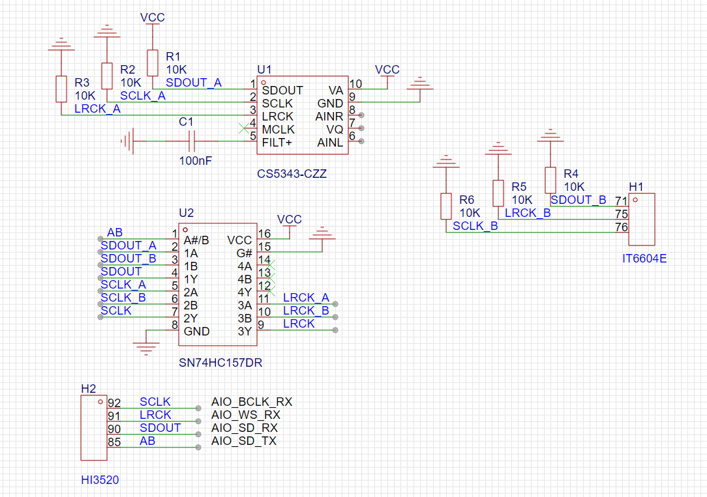
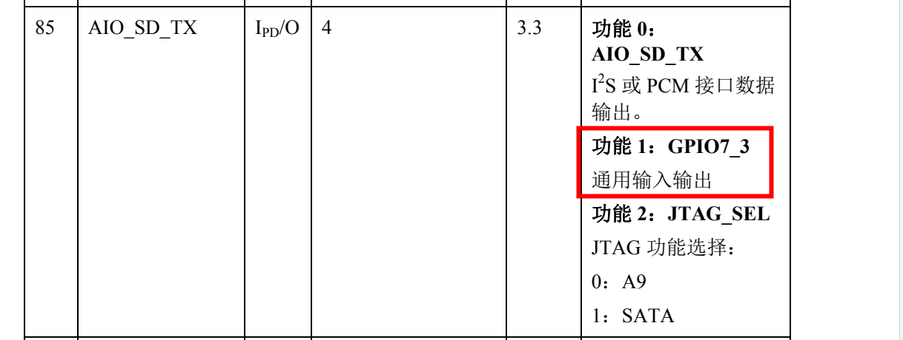
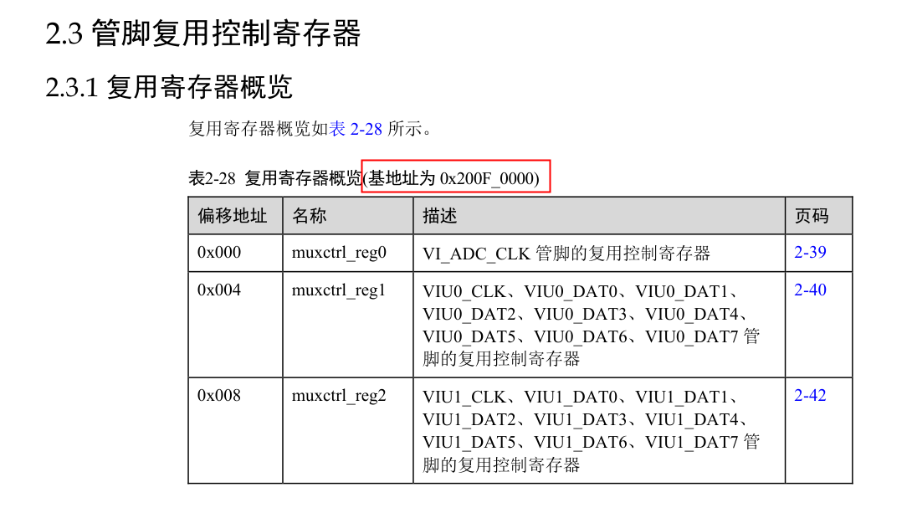
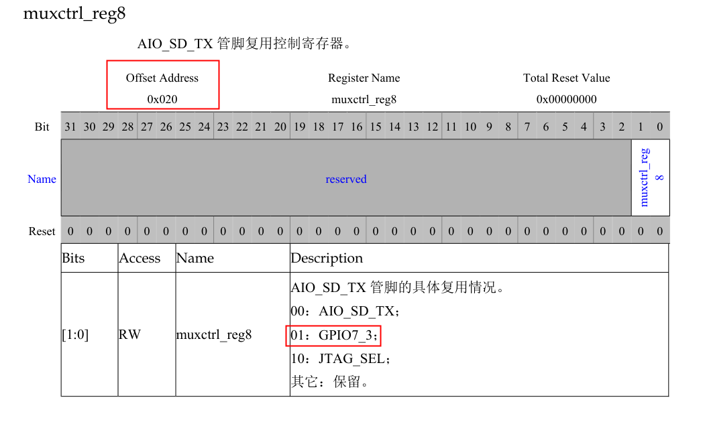
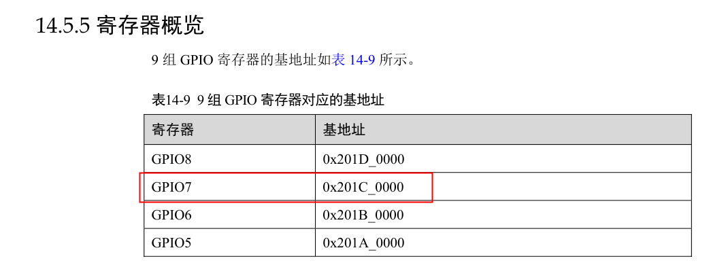
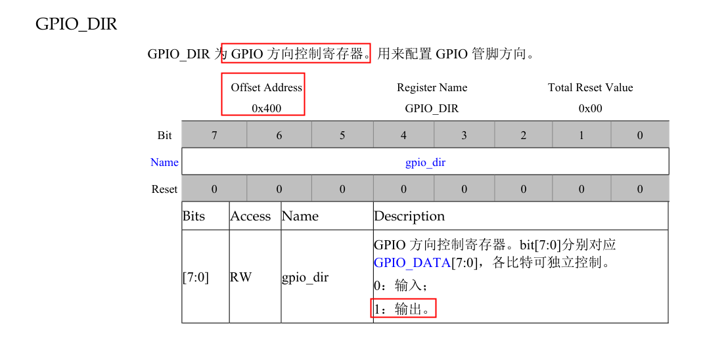
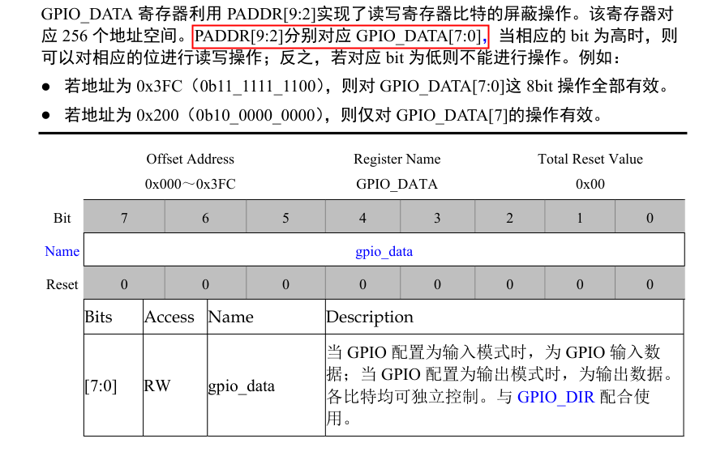

# 402 编码器(3520DV200)音频输入切换问题解决方案

| Version | Date | Description |
| :---- | :---- | :---- |
| 1.0 | 2023-7-11 | 初次发布 |
| 1.1 | 2023-8-9 | 修改第 4 节中偏移地址的错误 |

## 1. 前言

原生 402 编码器可对 HDMI 输入的和 Line-in 输入的音频进行编码，并且可在 web 应用中对输入音源进行切换。但海思 3520DV200 的开发文档中标明，3520DV200 芯片只支持 1 个音频输入口，且在软件层并未开放音频输入源切换的相关接口。因此推测，音源切换的功能可能由部分硬件直接实现。

## 2. 硬件实现原理

经线路分析后，402 编码器关于音源切换的硬件实现原理图如下：



IT6604E 是单链路 HDMI 接收器，CS5343-CZZ 是用于音频采集的 ADC。SN74HC157 为四路 2-line 转 1-line 数据选择器（多路复用器）。

SN74HC157 同时接入 IT6604E 和 CS5343 输出的音频信号，并通过判断 AB 引脚的高低电平，来选择最终将哪一路输入进行输出。

AB 信号连接至 HI3520 的 85 引脚，并使用其 GPIO 的功能。

海思 85 引脚复用定义如下：



## 3. GPIO 配置

GPIO 的设置一般为三步：

1. 设置 GPIO 端口复用
2. 设置 GPIO 口的读写方向
3. 读取或者写入 GPIO 值

### 3.1 设置管脚复用

查阅文档中关于寄存器复用的信息：



`AIO_SD_TX`管脚相关信息：



要使用`GPIO7_3`的功能，需要将复用控制寄存器`muxctrl_reg8`的值设定为`0x01`。

`muxctrl_reg8`的基地址为`0x200F_0000`，偏移地址为`0x0020`，所以`muxctrl_reg8`的地址为`0x200F0020`。

通过 Hisi 自带的`himm`命令即可修改寄存器的值，完成开启管脚 GPIO 功能的设定：

```sh
himm 0x200F0020 0x01
```

**NOTE:** 海思中的`himm`、`himc`、`himd.l`等命令，本质上只是对寄存器的操作命令。

### 3.2 设置 GPIO 读写方向

查找 GPIO 基地址：



方向控制偏移地址与控制值：



当为 GPIO 方向寄存器赋值为`0x01`时，该 GPIO 口用作输出功能。

`GPIO7`的基地址为`0x201C_0000`，`GPIO_DIR`寄存器的偏移地址为`0x0400`，`GPIO7`的`GPIO_DIR`方向寄存器的实际地址为`0x201C0400`。`GPIO_DIR`寄存器里有 8 位独立控制位，每一位对应一个 GPIO 的方向。如果需要将`GPIO7_3`设置为输出，则需要将`BIT3`设置为`1`。

若需将`GPIO7_3`设置为输出，执行如下命令：

```sh
himm 0x201C0400 0x08
```

### 3.3 读取或者写入 GPIO 值

`GPIO_DATA`寄存器操作：



`GPIO_DATA[3]`的偏移地址为`0x020(0b00_0010_0000)`。

若需配置`GPIO7_3`的写入值为`1`，执行如下命令：

```sh
himm 0x201C0020 0x08
```

## 4. 402 编码器配置

在 402 编码器中，为`GPIO7_3`赋`1`值时，编码器接入 HDMI 的声音，为`GPIO7_3`赋`0`值时，编码器接入 Line-in 的声音。

```sh
# GPIO7_3 AUDIO_CTRL

# HDMI
himm 0x201C0020 0x08

# Line-in
himm 0x201C0020 0x00
```

## 5. Reference

1. [海思的几种 gpio 操作方法](https://blog.csdn.net/weixin_39481144/article/details/115526796)
2. [海思配置及控制 GPIO](https://blog.csdn.net/weixin_43835637/article/details/105374714)
3. [IT6604E Datasheet](http://www.icware.ru/pdf/0003912.pdf)
4. [CS5343 Datasheet](https://www.mouser.com/datasheet/2/76/CS5343-44_F5-1142054.pdf)
5. [SNx4HC157 Datasheet](https://www.ti.com/lit/ds/symlink/sn54hc157-sp.pdf?ts=1689042863634&ref_url=https%253A%252F%252Fwww.google.com%252F)
