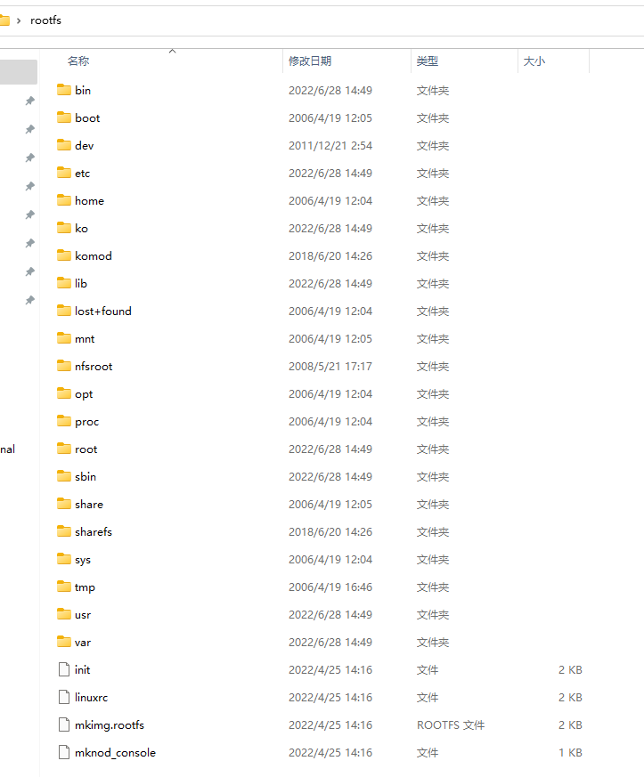

# Introduction

## [Root File System](Root File System.md)

/ --------------根目录，所有目录挂在其下

/boot ---------存放Ubuntu内核和系统启动文件。系统启动时这些文件先被装载。

/etc ----------系统的配置文件目录。密码文件、设置网卡信息、环境变量的设置等都在此目录中，许多网络配置文件也在其中。

/lib ------------根文件系统目录下程序和核心模块的共享库。这个目录里存放着系统最基本的动态链接共享库，类似于Windows下的system32目录，几乎所有的应用程序都需要用到这些共享库。

/media    ------ 主要用于挂载多媒体设备。ubuntu系统自动挂载的光驱、usb设备，存放临时读入的文件。

/proc   --------- 这个目录是系统内存的映射，我们可以直接访问这个目录来获取系统信息。也就是说，这个目录的内容不在硬盘上而是在内存里。

/sbin ---------- s就是Super User的意思，这里存放的是系统管理员使用的系统管理程序，如系统管理、目录查询等关键命令文件。

/tmp ---------- 这个目录是用来存放一些临时文件的，所有用户对此目录都有读写权限。
	
/home --------- 用户的主目录。下面是自己定义的用户名的文件夹。每个用户的设置文件，用户的桌面文件夹，还有用户的数据都放在这里。
	
/mnt ----------- 此目录主要是作为挂载点使用。通常包括系统引导后被挂载的文件系统的挂载点。如挂载Windows下的某个分区。

## Embedded Linux System

### 运行顺序

嵌入式Linux系统启动的时候，会从这个文件系统中，调用`init`这个程序，`init`作为Linux系统启动的**第一个进程**，会从这里`fork`出很多其他的进程来。

Linux系统的启动过程可以分为5个阶段：

- 内核的引导
- 运行 `init`
- 系统初始化
- 建立终端
- 用户登录系统

在嵌入式环境下，由`uboot`来加载内核，然后内核加载完成后，运行`init`

**reference:** [uboot, kernel, rootfs](uboot, kernel, rootfs.md)

