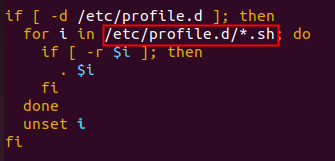

# `/etc/profile`, `~/.bashrc`, `/etc/profile.d/*.sh` 之间的关系与区别

## bash 的运行模式

**NOTE:** bash的运行模式可分为`login shell`和`non-login shell`

**login shell：**

- 例如，我们通过终端，输入用户名、密码，登录系统之后，得到就是一个 login shell

**non-login shell:**

- 当我们执行以下命令 ssh hadoop103 command，在 hadoop103 执行 command 的就是一个 non-login shell

## 区别

- 启动时加载的配置文件不同：
  - login shell 启动时会加载`~/.bashrc`
  - non-login shell 启动时会加载`/etc/profile`

但是无论在加载 `~/.bashrc`（实际上是加载了`~/.bashrc`中的`/etc/bashrc`）或 `/etc/profile` 时，都会执行如下代码片段：

所以，无论在 login shell 或 non-login shell 环境中，都会加载`/etc/profile.d/*.sh`文件
