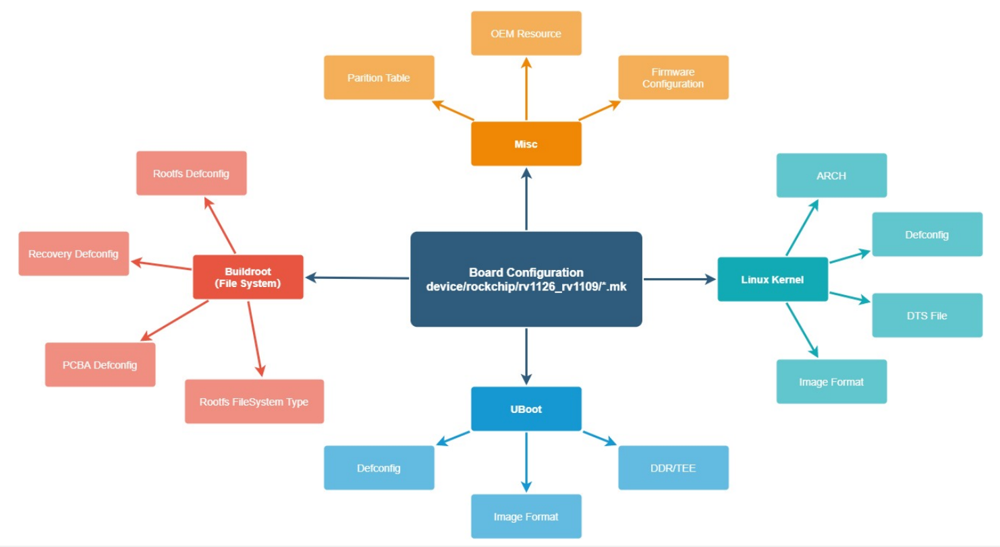

# 开发环境及SDK内容

## Dependent lib

```bash
sudo apt-get install repo git-core gitk git-gui gcc-arm-linux-gnueabihf u-boot-tools device-tree-compiler gcc-aarch64-linux-gnu mtools parted libudev-dev libusb-1.0-0-dev python-linaro-image-tools linaro-image-tools autoconf autotools-dev libsigsegv2 m4 intltool libdrm-dev curl sed make binutils build-essential gcc g++ bash patch gzip gawk bzip2 perl tar cpio python unzip rsync file bc wget libncurses5 libqt4-dev libglib2.0-dev libgtk2.0-dev libglade2-dev cvs git mercurial rsync openssh-client subversion asciidoc w3m dblatex graphviz python-matplotlib libc6:i386 libssl-dev expect flex liblz4-tool lib32gcc-7-dev g++-7 libstdc++-7-dev
```

## Structure of SDK



### Introduction of Buildroot

```
buildroot
├── arch: 存放CPU架构相关的配置脚本，如arm/mips/x86，这些CPU相关的配置，在制作工具链时，编译uboot和kernel时很关键
├── board：在构建系统时，board默认的boot和kernel配置文件，以及一些板级相关脚本，存放一些默认开发板的配置补丁之类
├── boot：bootloader配置脚本目录，可以选择使用uboot作为bootloader
├── build：所有源码包解压出来的文件存放目录和编译过程的发生目录
├── configs: 板级配置文件，该目录下的配置文件记录着该机器平台或者方案使用的工具链，boot，kernel，各种应用软件包的配置
├── dl: download的简写，一些开源包下载后存在该目录；首次下载后，下次不会再从官网下载，而从dl/目录拿开源包，以节约时间 
├── docs: 存放相关的参考帮助文档
├── fs: 各种文件系统的自动构建脚本 
├── linux: 存放着kernel的自动构建脚本
├── output: 是编译出来的输出文件夹
│   ├── build: 存放解压后的各种软件包编译完成后的现场，包括主机上Buildroot所需的工具和针对目标编译的软件包
│   ├── host: 存放着制作好的编译工具链，如gcc、arm-linux-gcc等工具
│   ├── images: 存放着编译好的uboot.bin, zImage, rootfs等镜像文件，可烧写到板子里, 让linux系统跑起来
│   ├── staging：是到内部目标工具链host/的符号链接
│   └── target: 用来制作rootfs文件系统，存放Linux系统基本的目录结构，以及编译好的应用库和bin可执行文件。(buildroot根据用户配置把.ko .so .bin文件安装到对应目录中)
├── package：下面放着应用软件的配置文件，每个应用软件的配置文件有Config.in和soft_name.mk
├── support：公共的支持文档(kconfig code, libtool patches, download helpers, and more)
├── system：根目录主要骨架和相关启动初始化配置，存放文件系统目录的和设备节点的模板，这些模板会被拷贝到output/目录下，用于制作根文件系统rootfs
├── toolchain：目录中存放着各种制作工具链的脚本
├── utils：常用工具
├── CHANGES
├── Config.in
├── Config.in.legacy
├── COPYING
├── DEVELOPERS
├── Makefile
├── Makefile.legacy
└── README
```

