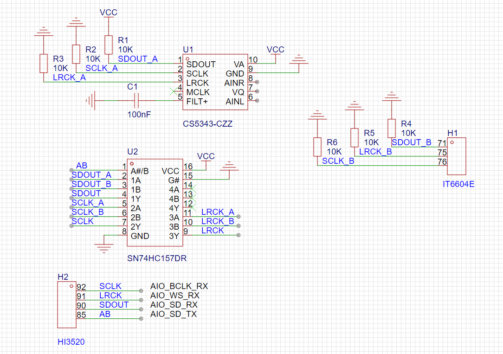
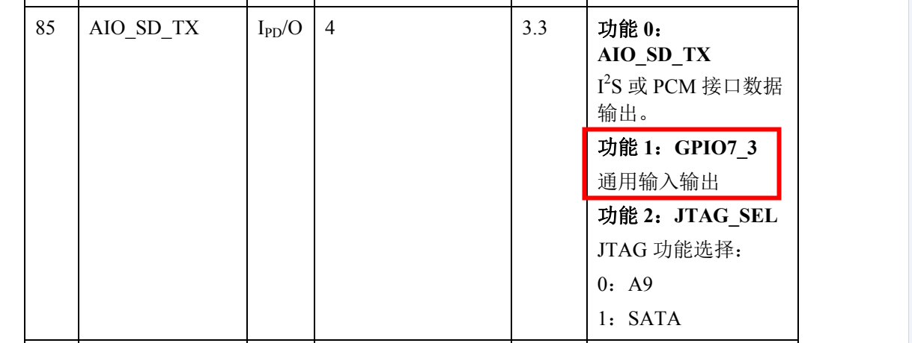
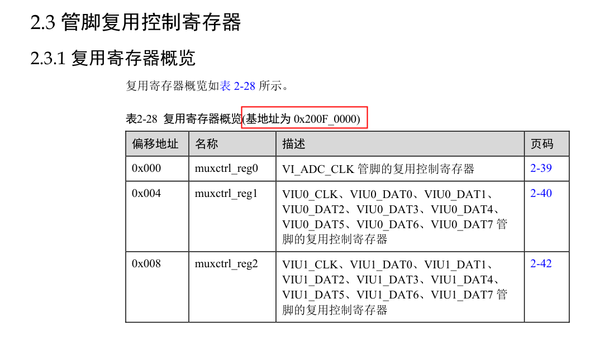
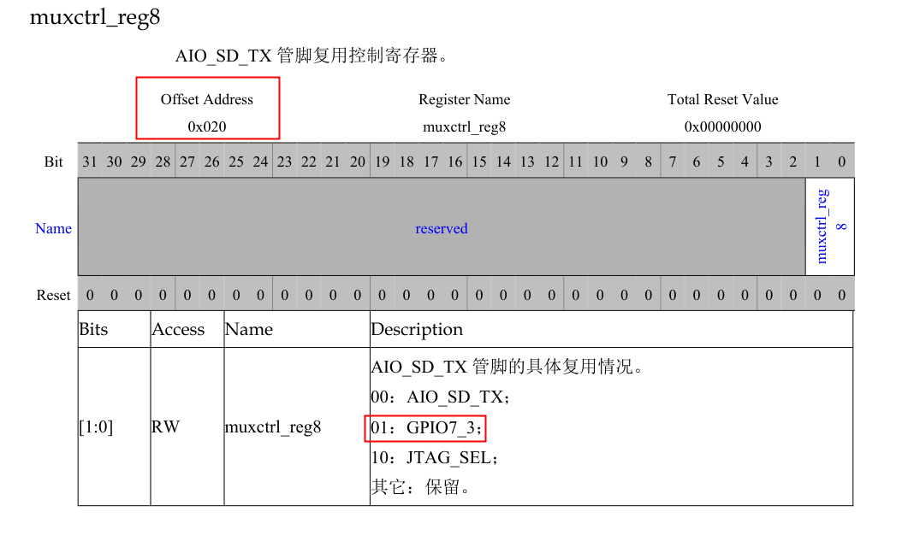
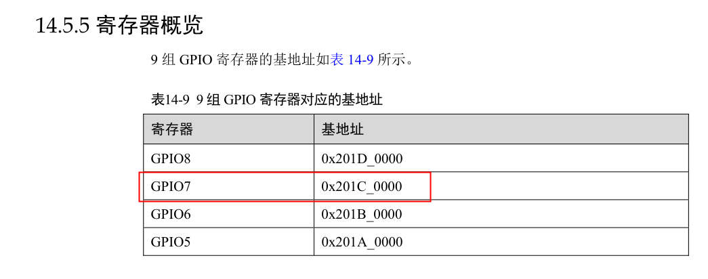
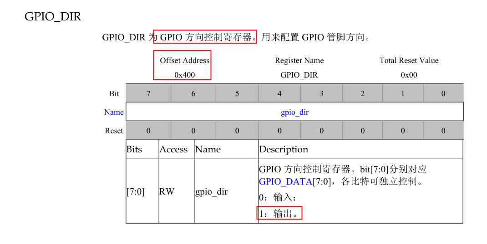
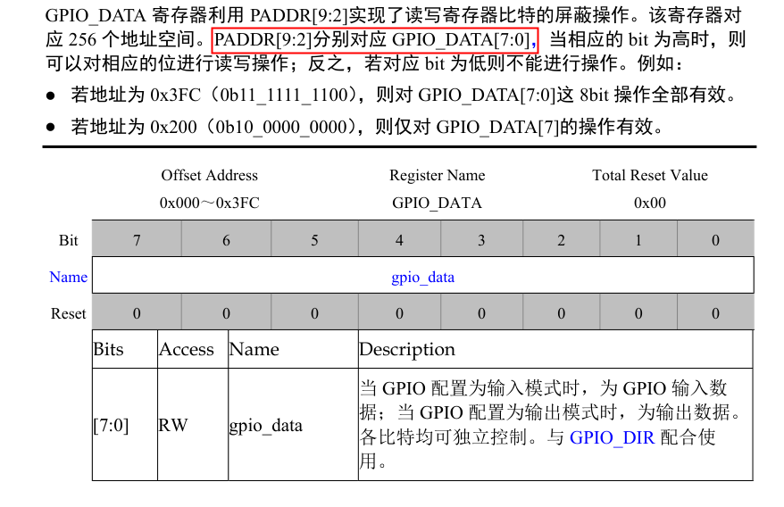

# 402编码器（3520DV200）音频输入切换问题解决方案

| Version | Date      | Description     |
| ------- | --------- | --------------- |
| 1.0     | 2023-7-11 | Initial release |

## 前言

原生402编码器可对HDMI输入的和Line-in输入的音频进行编码，并且可在web应用中对输入音源进行切换。但海思3520DV200的开发文档中标明，3520DV200芯片只支持1个音频输入口，且在软件层并未开放音频输入源切换的相关接口。因此推测，音源切换的功能可能由部分硬件直接实现。

## 硬件实现原理

经线路分析后，402编码器关于音源切换的硬件实现原理图如下：



IT6604E是单链路HDMI接收器，CS5343-CZZ是用于音频采集的ADC。SN74HC157为四路2-line转1-line数据选择器（多路复用器）。

SN74HC157同时接入IT6604E和CS5343输出的音频信号，并通过判断AB引脚的高低电平，来选择最终将哪一路输入进行输出。

AB信号连接至HI3520的85引脚，并使用其GPIO的功能。

海思85引脚复用定义如下：



## GPIO配置

GPIO的设置一般为三步：

1. 设置GPIO端口复用
2. 设置GPIO口的读写方向
3. 读取或者写入GPIO值

### 设置管脚复用

查阅文档中关于寄存器复用的信息：



`AIO_SD_TX`管脚相关信息：



要使用`GPIO7_3`的功能，需要将复用控制寄存器`muxctrl_reg8`的值设定为`0x01`。

`muxctrl_reg8`的基地址为`0x200F_0000`，偏移地址为`0x0020`，所以`muxctrl_reg8`的地址为`0x200F0020`。

通过Hisi自带的`himm`命令即可修改寄存器的值，完成开启管脚GPIO功能的设定：

```sh
himm 0x200F0020 0x01
```

**NOTE:** 海思中的`himm`、`himc`、`himd.l`等命令，本质上只是对寄存器的操作命令。

### 设置GPIO读写方向

查找GPIO基地址：



方向控制偏移地址与控制值：



当为GPIO方向寄存器赋值为`0x01`时，该GPIO口用作输出功能。

`GPIO7`的基地址为`0x201C_0000`，`GPIO_DIR`寄存器的偏移地址为`0x0400`，`GPIO7`的`GPIO_DIR`方向寄存器的实际地址为`0x201C0400`。`GPIO_DIR`寄存器里有8位独立控制位，每一位对应一个GPIO的方向。如果需要将`GPIO7_3`设置为输出，则需要将`BIT3`设置为`1`。

若需将`GPIO7_3`设置为输出，执行如下命令：

```sh
himm 0x201C0400 0x08
```

### 读取或者写入GPIO值

`GPIO_DATA`寄存器操作：



`GPIO_DATA[3]`的偏移地址为`0x020(0b00_0010_0000)`。

若需配置`GPIO7_3`的写入值为`1`，执行如下命令：

```sh
himm 0x201C0020 0x08
```

## 402编码器配置

在402编码器中，为`GPIO7_3`赋`1`值时，编码器接入HDMI的声音，为`GPIO7_3`赋`0`值时，编码器接入Line-in的声音。

```sh
# GPIO7_3 AUDIO_CTRL

# HDMI
himm 0x200F0020 0x08

# Line-in
himm 0x200F0020 0x00
```

## Reference

1. [海思的几种gpio操作方法](https://blog.csdn.net/weixin_39481144/article/details/115526796)
2. [海思配置及控制GPIO](https://blog.csdn.net/weixin_43835637/article/details/105374714)
3. [IT6604E Datasheet](http://www.icware.ru/pdf/0003912.pdf)
4. [CS5343 Datasheet](https://www.mouser.com/datasheet/2/76/CS5343-44_F5-1142054.pdf)
5. [SNx4HC157 Datasheet](https://www.ti.com/lit/ds/symlink/sn54hc157-sp.pdf?ts=1689042863634&ref_url=https%253A%252F%252Fwww.google.com%252F)
