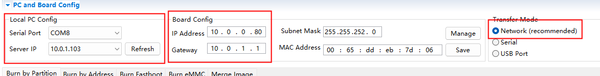
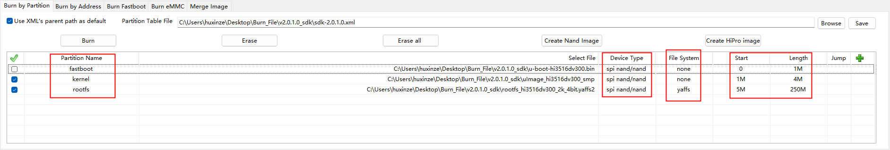

# hi3516dv300固件烧录指南-1.0

**NOTES:** `HiBurn`烧录中传输的指令起始地址为`0x81000000`，而套件初始的`bootcmd`中的地址通常为`0x82000000`。如果`bootcmd`中的起始地址为`0x82000000`，且不烧录`u-Boot`，仅替换`kernel`和`rootfs`的情况下，优先选择指令烧录。在可替换`u-Boot`的情况下，可以选择`HiBurn`烧录。**如果使用`HiBurn`烧录的固件无法正常启动，需转至`u-Boot`中使用指令烧录**

如果`u-Boot`被擦除，可使用`HiBurn`进行`u-Boot`的烧录

存储介质为EMMC的设备优先选择使用指令烧录固件

## 1. 环境准备与地址说明

### 1.1 环境准备

1. PC与单板之间连接好**串口**
1. 连接**电源**和**网线**

### 1.2 地址说明

dv300地址起始位为0x80000000；ev300地址起始位为0x40000000

以容量为 256M Bytes 的 DDR 内存为例：


## 2. `HiBurn`烧写

### 2.1 选择设备


### 2.2 配置网络信息



1. 选择网络传输（USB传输和串口传输速度很慢）
2. 选择相应串口和tftp server的IP，配置板端IP信息

### 2.3 烧写步骤

#### 2.3.1 选择按分区烧写


#### 2.3.2 配置分区信息和烧录



1. 选择各分区对应的文件
2. 选择和板子相匹配的设备类型（spi nand 或者spi nor等）
3. 选择适配的文件系统类型
4. 配置正确的文件长度
5. 勾选需要烧录的内容（kernel，rootfs等）
6. 点按**Burn(烧录)**
7. 断电重启

**NOTES:** 存储介质为EMMC的在标签页选择*Burn eMMC*，配置方式与上述内容相同。

## 3. `u-Boot`指令烧写

### 3.1 配置设备IP，tftp server

```sh
# board ip
setenv ipaddr 10.0.0.80
# tftp server ip
setenv serverip 10.0.1.101
# MAC
setenv ethaddr xx:xx:xx:xx:xx:xx
# netmask
setenv netmask 255.255.252.0
# gateway
setenv gatewayip 10.0.1.1
# test the connectivity of the network
ping 10.0.1.101 
```

### 3.2 SPI nand Flash

#### 3.2.1 u-boot

```sh
mw.b 0x82000000 0xff 0x80000
tftp 0x82000000 u-boot-hi3516dv300.bin
nand erase 0x0 0x80000
nand write 0x82000000 0x0 0x80000
```

#### 3.2.2 kernel

```sh
mw.b 0x82000000 0xff 0x400000
tftp 0x82000000 uImage_hi3516dv300_smp
nand erase 0x100000 0x400000
nand write 0x82000000 0x100000 0x400000
```

#### 3.2.3 rootfs

```sh
mw.b 0x82000000 0xff 0x2000000
tftp 0x82000000 rootfs_hi3516dv300_2k_4bit.yaffs2
nand erase 0x500000 0xfa00000
nand write.yaffs 0x82000000 0x500000 0x11cc100
```

**NOTES:** 0x1183e00 为 rootfs 镜像文件的实际大小（16 进制）

### 3.3 SPI  nor Flash

#### 3.3.1 u-boot

```sh
mw.b 0x42000000 0xff 0x80000
tftp 0x42000000 u-boot-hi3516ev300.bin
sf probe 0x0;sf erase 0x0 0x80000;sf write 0x42000000 0x0 0x80000
```

#### 3.3.2 kernel

```sh
mw.b 0x42000000 0xff 0x400000
tftp 0x42000000 uImage_hi3516ev300
sf probe 0x0;sf erase 0x100000 0x400000;sf write 0x42000000 0x100000 0x400000
```

#### 3.3.3 rootfs

```sh
mw.b 0x42000000 0xff 0xb00000
tftp 0x42000000 rootfs_hi3516ev300_64k.jffs2
sf probe 0x0;sf erase 0x500000 0xb00000;sf write 0x42000000 0x500000 0xb00000
```

### 3.4 EMMC

#### 3.4.1 emmc分区

eMMC 标准中，将内部的 Flash Memory 划分为 4 类区域，最多可以支持 8 个硬件分区，如下图所示


分区信息表


#### 3.4.2 u-boot

```shell
mw.b 0x82000000 0xff 0x80000
tftp 0x82000000 u-boot-hi3516dv300.bin
mmc write 0x0 0x82000000 0x0 0x800
```

#### 3.4.3 kernel

```shell
mw.b 0x82000000 0xff 0x400000
tftp 0x82000000 uImage
mmc write 0x0 0x82000000 0x800 0x2000
```

#### 3.4.4 rootfs

```shell
mw.b 0x82000000 0xff 0x9000000  
tftp 0x82000000 rootfs.ext4
mmc write.ext4sp 0x0 0x82000000 0x2800 0xE00000
```

**NOTES:** `0xE00000`表示内存大小所需要的block数量（在8号套件上 1 block大小为512 Bytes，即0x200 Bytes，$0x1 C000 0000 \div 0x200 = 0xE0 0000$)

## 4. 配置启动参数

**NOTES:** linux-4.9.y kernel 默认文件系统只读，需要在 bootargs 中加入 rw 选项，文件系统才可读写

`bootargs`中`mem`的数值为系统内存的大小，需要与load3516dv300文件中的表示的`os_mem`相匹配，属于Linux OS的部分

### nand flash

```sh
setenv bootargs 'mem=512M console=ttyAMA0,115200 root=/dev/mtdblock2 rootfstype=yaffs2 rw mtdparts=hinand:1M(boot),4M(kernel),250M(rootfs)'
setenv bootcmd 'nand read 0x82000000 0x100000 0x400000;bootm 0x82000000'
```

### nor flash

```sh
setenv bootargs 'mem=32M console=ttyAMA0,115200 root=/dev/mtdblock2 rootfstype=jffs2 rw mtdparts=hi_sfc:1M(boot),4M(kernel),11M(rootfs)'
setenv bootcmd 'sf probe 0;sf read 0x42000000 0x100000 0x400000;bootm 0x42000000'
```

### eMMC

```sh
setenv bootargs 'mem=256M console=ttyAMA0,115200 root=/dev/mmcblk0p3 rw rootfstype=ext4 rootwait blkdevparts=mmcblk0:1M(boot),4M(kernel),7168M(rootfs)'
setenv bootcmd 'mmc read 0 0x82000000 800 2000;bootm 0x82000000'
```

## 5. 修改load文件

```sh
mem_total=256                 # 256M, total mem
mem_start=0x80000000          # phy mem start
os_mem_size=128               # 128M, os mem
mmz_start=0x88000000;         # mmz start addr
mmz_size=128M;                # 128M, mmz size
```

**NOTES:** `load3516dv300`文件的作用是**为文件系统加载 SDK 提供的`.ko`文件**，不修改`load3516dv300`文件的情况下，可以以传递命令行参数的形式配置`mmz_size`和`mem_total`大小

```sh
./load3516dv300 -i -osmem 256 -total 1024
```

## 6. Reference

1. [Uboot的bootargs引导参数说明](https://www.365seal.com/y/ABpkZMg6VM.html)
2. [海思芯片系统镜像烧写教程](https://zhuanlan.zhihu.com/p/71789194)
3. Release Doc/01.software/board/SDK 安装及升级使用说明.pdf
4. Release Doc/01.software/pc/HiTool/HiBurn工具使用指南.pdf
5. [Hi3559AV100制作ext4文件系统和烧录emmc](https://blog.csdn.net/xclshwd/article/details/88013064)
