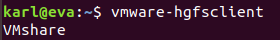
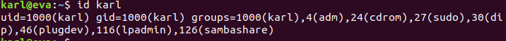

# 共享文件挂载问题

**problem: **安装`vmware-tools`后依旧无法启用共享文件夹

```bash
# 执行`vmare-hgfsclient`查看是否有共享文件夹
sudo vmare-hgfsclient
```




**resolution: **更改`vmhgfs-fuse`的工作情况

先使用`id`查看用户信息：



```bash
sudo vmhgfs-fuse .host:/ /mnt/hgfs -o nonempty -o allow_other -o uid=1000 -o gid=1000 -o umask=022
```

**note: **此方法可能在重启虚拟机时，需要再执行一遍

## 添加系统脚本

在`/etc`目录下增加`rc.local`文件

```bash
sudo vim /etc/rc.local
```

文件内容为：

```bash
#！/bin/sh
sudo vmhgfs-fuse .host:/ /mnt/hgfs -o nonempty -o allow_other -o uid=1000 -o gid=1000
exit 0
```

```bash
chmod 777 /etc/rc.local
```

## 设置开机自动挂载

```bash
# 编辑 fstab 文件
sudo vim /etc/fstab
# 增加一行 把主机的web目录挂载到虚拟机的web目录
.host:/   /mnt/hgfs/   fuse.vmhgfs-fuse   allow_other,uid=1000,gid=1000,umask=022   0   0
```

`fuse.vmhgfs-fuse`和`vmhgfs-fuse` 都可以试试

