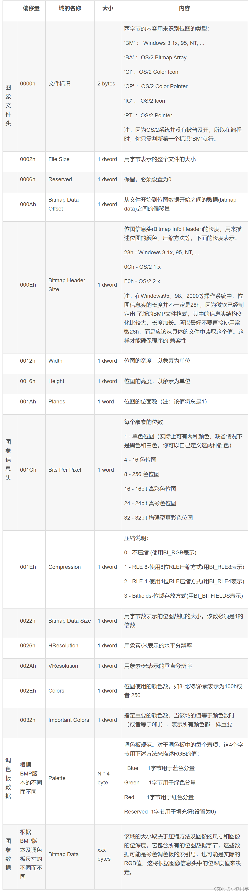

# Bitmap

## Alpha channel

 如果图形卡具有32位总线，附加的8位信号就被用来保存不可见的透明度信号以方便处理用，这就是Alpha通道。白色的alpha像素用以定义不透明的彩色像素，而黑色的alpha象素用以定义透明象素，黑白之间的灰阶用来定义半透明象素。

## Stride

Image Stride(内存图像行跨度) 当视频图像存储在内存时，图像每一行的**末尾**也许包含一些**扩展的内容**，这些扩展的内容**只影响图像如何存储在内存中，但是不影响图像如何显示出来**；*Stride* 就是这些**扩展内容**的名称，*Stride* 也被称作 *Pitch*，如果图像的每一行像素末尾拥有扩展内容，Stride 的值一定大于图像的宽度值

Stride的值需要与4补齐，补齐方法见[《位数补齐》](../Algorithm/位数补齐.md)

## 详解

### 识别

每种图片格式都有定义好的一种识别方法，BMP图片特征是，二进制数据以**0x424D**开头，**B**对应的ASCII码值为**42**，**M**对应的ASCII码值为**4D**

### 组成

1. 头信息——BMP图片的一些属性，如分辨率，偏移量等
2. 有效信息——所有的像素数据

## BMP文件头、信息头、图片有效数据区



## 代码解析BMP步骤

1. 打开BMP图片
2. 判断图片格式是否真是BMP
3. 解析头信息，得到该BMP图片的详细信息
4. 根据第三步得到的信息，去合适位置提取真正的有效图片信息
5. 将得到的有效数据丢到fb中去显示

## 解析BMP文件头

### 使用数组

```c
//参数列表：path:要解析的图片的文件名
//函数功能  ：解析bmp图片，并将解析出的数据放到bmp_buf[]数组中
//返回值     ：错误时返回-1，正确时返回0
int bmp_analyze(char *path)
{
	int ret, fd = -1;
	unsigned char buf[54] = {0};	//用于存储读取的bmp文件的头信息
							  		//之所以大小设为54是根据bmp文件的	
									//头信息组成的各部分的大小决定的	


	//第一步：打开BMP图片
	fd = open(path, O_RDONLY);
	if (fd < 0)
	{
		//fprintf函数格式化输出到一个流文件中		
		fprintf(stderr,"open %s error.\n", path);
		return -1;
	}


	//第二步：判断图片格式是否真是BMP
	ret = read(fd, buf, 54);
	if (ret != 54)
	{
		fprintf(stderr,"read file header error.\n");
		close(fd);
		return -1;
	}


	//第三步：解析头信息，得到该BMP图片的详细信息
	printf("%x %x.\n", buf[0], buf[1]);
	if((buf[0] != 'B') || (buf[1] != 'M'))
	{
		fprintf(stderr,"file %s is not a bmp picture.\n", path);
		close(fd);
		return -1;
	} 


	//第四步：根据第三步得到的信息，去合适位置提取真正的有效图片信息
	printf("%s is a real bmp picture.\n", path);
	printf("width is %u\n", *((unsigned int*)(buf+0x12)));
	printf("height is %u\n", *((unsigned int*)(buf+0x16)));
	

	//第五步：将得到的有效数据丢到fb中去显示	


	//第六步：关闭打开的文件
	close(fd);
	
	return 0;
}
```

### 使用结构体

```c
typedef struct tagBITMAPFILEHEADER
{
	//unsigned short      bfType;//文件的标识，值必须是0x4D42（也就是“BM”两个字符，注意是Little-Endian）
	unsigned long       bfSize;//是整个文件的大小
	unsigned short      bfReserved1;//bfReserved1和bfReserved2必须是0.
	unsigned short      bfReserved2;//bfReserved1和bfReserved2必须是0.
	unsigned long       bfOffBits;//是位图数据在文件中的偏移
} BITMAPFILEHEADER, *PBITMAPFILEHEADER;

	BITMAPFILEHEADER fHeader;
	unsigned short temp;
	
	//第一步：打开BMP图片
	fd = open(path, O_RDONLY);
	if (fd < 0)
	{
		//fprintf函数格`式化输出到一个流文件中		
		fprintf(stderr,"open %s error.\n", path);
		return -1;
	}

	//第二步：读取bmp文件头部信息，得到该BMP图片的详细信息
	read(fd, &temp, sizeof(temp));//跳过开头的两个字节，避免结构体对齐带来的影响
	read(fd, &fHeader, sizeof(fHeader));//读取文件头
	printf("bfSize = %ld.\n", fHeader.bfSize);
	printf("bfOffBits = %d.\n", fHeader.bfOffBits);

```

## 解析BMP文件的信息头

```c
//BMP图像信息头
typedef struct tagBITMAPINFOHEADER
{
	unsigned long       biSize;//BITMAPINFOHEADER这个结构体的大小。必须为40（字节
	long                biWidth;//BMP位图的宽度
	long                biHeight;//BMP位图的高度
	unsigned short      biPlanes;//位图的“位面数”。这个值必须为1.
	unsigned short      biBitCount;//位图的“颜色位数”，颜色位数为1表示单色(其实是“双色”，通常是黑白，也可以是别的两个颜色。)为2表示四色，也就是四种颜色。为4表示16种颜色。为8表示有256种颜色。
	unsigned long       biCompression;//位图的压缩格式
	unsigned long       biSizeImage;//位图数据块的大小。以字节为单位。如果你的位图没有经过压缩，这个值可以是0.
	long                biXPelsPerMeter;//表示横向的每米的像素数。可以为0.
	long                biYPelsPerMeter;//表示纵向的每米的像素数。可以为0.
	unsigned long       biClrUsed;//位图实际使用过的调色板的颜色数。如果这个值为0，表示这个位图使用了整个调色板。只有8位以及8位以下的索引颜色位图才需要考虑这个值。
	unsigned long       biClrImportant;//指定重要的颜色数
} BITMAPINFOHEADER, *PBITMAPINFOHEADER;

```

```c
	BITMAPINFOHEADER info;

	read(fd, &info, sizeof(info));//读取信息头
	printf("picture resolution:%d*%d.\n", info.biWidth, info.biHeight);
	printf("picture bpp:%d.\n", info.biBitCount);

```

## BMP图片的显示

```c
	//第三步：根据第二步得到的信息，去合适位置提取真正的有效图片信息
	//先将文件指针移动到有效信息所在的偏移量bfOffBits处
	//然后读出(info.biWidth*info.biHeight*info.biBitCount/3)字节大小的数据
	lseek(fd, fHeader.bfOffBits, SEEK_SET);
	len = info.biWidth*info.biHeight*info.biBitCount/3;
	read(fd, &bmp_buf, len);

	
	//第四步：将得到的有效数据丢到fb中去显示	
	lcd_display_picture(0, 0, bmp_buf, info.biWidth, info.biHeight);

```

```c
//因为该BMP图片数据的存储方式是自底至上，与之前使用软件得到的自上至底的数据是不同的
//故显示函数也需要做出一定的改变
void lcd_display_picture(int x0, int y0, const unsigned char *pData, long width, long height)
{
	unsigned int x, y, color, p = 0;

	p = width*height*3-3 ;
		
	for(y = y0; y < (height+y0); y++)
	{
		if(y > HEIGHT)
			break;
		for(x = x0; x < (width+x0); x++)
		{
			if(x > WIDTH)
			{
				p += 3;
				continue;
			}	
			color = ((pData[p+2] << 16)|(pData[p+1] << 8)|(pData[p+0] << 0));//得到图片一个像素点的颜色
			*(pfb + y * WIDTH + x) = color;//将图片像素点的颜色填充到LCD屏幕的某个像素点上
			p -= 3;
		}

	}

	printf("lcd_display_picture ending.\n");

}

```


