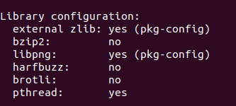

# OSD准备：移植freetype、SDL、SDL_ttf

## 源码网址

[The FreeType Project](https://freetype.org/)

[SDL](https://github.com/libsdl-org/SDL)

[SDL_ttf](https://github.com/libsdl-org/SDL_ttf)

## 编译

### FreeType和SDL

1. FreeType和SDL使用相同的配置

    ```bash
    ./configure CC=arm-himix200-linux-gcc --host=arm-himix-linux --prefix=$PWD/HI_INSTALL --enable-shared=no --enable-static=yes
    ```

    **注：** `--enable-shared=no`和 `--enable-static=yes`表示只生成静态库

2. 编译

    ```bash
    make && make install
    ```

编译结果的最终保存目录为`--prefix`指明的目录

### SDL_ttf

1. 配置

    ```bash
    ./configure CC=arm-himix200-linux-gcc --host=arm-himix200-linux --prefix=$PWD/HI_INSTALL --with-freetype-prefix=/home/karl/Desktop/free-sdl/freetype-2.4.10/HI_INSTALL --with-sdl-prefix=/home/karl/Desktop/free-sdl/SDL-1.2.15/HI_INSTALL
    ```

    **注：**`--with-freetype-prefix`和`--with-sdl-prefix`的路径配置，尽量使用绝对路径

2. 编译

    ```bash
    make && make install
    ```

## 新版本FreeType出现的问题



### zlib

**下载路径：**[Zlib](http://www.zlib.net/fossils/?C=M;O=A)

#### 编译与安装

```bash
prefix=$PWD/tmp CC=arm-himix200-linux-gcc ./configure
make && make install
sudo cp -drf ./tmp/lib/* /opt/hisi-linux/x86-arm/arm-himix200-linux/target/usr/lib
sudo cp ./tmp/include/* /opt/hisi-linux/x86-arm/arm-himix200-linux/target/usr/include
```
