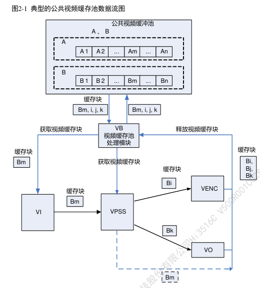

# Video Buffer

## 概念与作用

Video Buffer (VB, 视频缓存池)，主要向媒体业务提供大块物理内存管理功能，负责**内存**的**分配**和**回收**。让物理内存资源在各个媒体处理模块中合理使用。

**一组大小相同、物理地址连续的缓存块组成一个视频缓存池。**

由于视频输入通道不提供创建和销毁公共视频缓存池功能，因此，在系统初始化之前，必须为视频输入通道配置公共视频缓存池。根据业务的不同，公共缓存池的数量、缓存块的大小和数量不同。

VB数量与申请物理内存的业务数量有关，缓存块大小与数量则依据访问该VB的业务需求有关。

## 生命周期

VI 从公共视频缓存池 *B* 中获取视频缓存块 *Bm*，缓存块 *Bm* 经 VI发送给 VPSS，输入缓存块 *Bm* 经过 VPSS 处理之后被释放回公共视频缓存池。假设 VPSS 通道的工作模式是 USER，则 VPSS 通道 0 从公共视频缓存池 *B* 中获取缓存块 *Bi* 作为输出图像缓存 buffer 发送给 VENC，VPSS 通道 1 从公共视频缓存池 *B* 中获取缓存块 *Bk* 作为输出图像缓存 buffer 发送给 VO，*Bi* 经 VENC 编码完之后释放回公共视频缓存池，*Bk* 经 VO 显示完之后释放回公共视频缓存池。

图中所示缓存块的生存期是指经过 VPSS 通道传给后续模块的情形（ 图 2-1 实线路径）。
如果该缓存块完全没有经过 VPSS 通道传给其他模块，则将在 VPSS 模块处理后被放回公共缓存池（图 2-1 虚线路径）

## 初始化

