# hi3516dv300 固件烧录指南

| Version | Date      | Description                                      |
| :------ | :-------- | :----------------------------------------------- |
| 1.0     | 2023-4-25 | 发布初版                                         |
| 1.1     | 2323-10-7 | 添加分区信息文件使用方法，以及 fastboot 烧录方法 |

## 0. 部分操作说明

**NOTE:** 在进行固件烧录之前请先进入`U-boot`中查看`U-boot`的**环境变量**。在套件上电后出现*Hit any key to stop autoboot*时，按下任意键进入`U-boot`

查看起始地址可以在`U-boot`中使用指令`printenv`打印出`U-boot`环境变量，如下图所示：

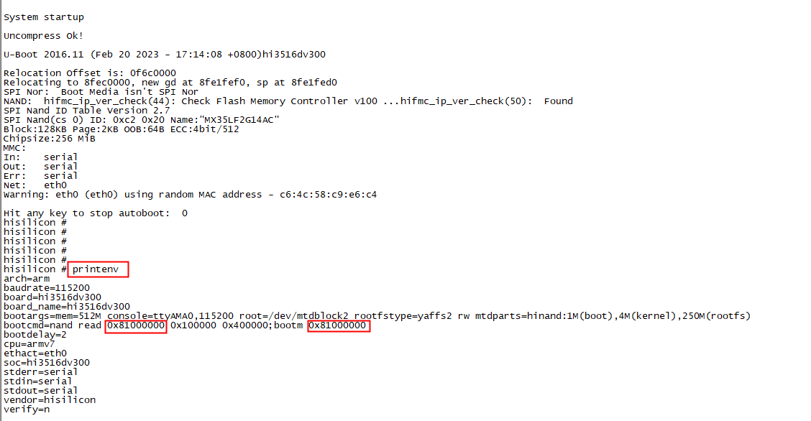

**NOTE:** `HiBurn`烧录中传输的指令起始地址为`0x81000000`，而套件初始的`bootcmd`中的地址**通常**为`0x82000000`。如果`bootcmd`中的起始地址为`0x82000000`，且不烧录`U-boot`，仅替换`kernel`和`rootfs`的情况下，优先选择指令烧录。在可替换`U-boot`的情况下，可以选择`HiBurn`烧录

`HIBurn`的工作原理在于，自动传输烧录的各个阶段所需要的指令到板端，但对于不同类型的设备（存储介质不同，如 SPI nor, SPI nand 等），都会采用内置的指令和参数进行烧录，且无法修改，**如果套件经过定制，出现如，需要其他烧写工具，`U-boot`无法替换等情况，使用`HiBurn`烧录的固件可能无法正常启动，需转至`U-boot`中使用指令烧录**

**NOTE:** 如果在使用指令烧录的过程中将`U-boot`从板端擦除，可使用`HiBurn`进行`U-boot`的烧录

**NOTE:** 存储介质为`eMMC`的设备，**优先选择使用指令烧录固件**

## 1. 环境准备与 DDR 地址说明

### 1.1 环境准备

1. PC 与单板之间连接好**串口**
2. 连接**电源**和**网线**

### 1.2 DDR 地址说明

dv300 的 DDR 地址起始位为 0x80000000；ev300 的 DDR 地址起始位为 0x40000000。

起始地址将作用在使用指令烧录固件的阶段，用于指定地址来缓存文件，以及`U-boot`启动`kernel`和`rootfs`的阶段，用于指定地址读取`kernel`和`rootfs`

以容量为 256M Bytes 的 DDR Memory 为例：

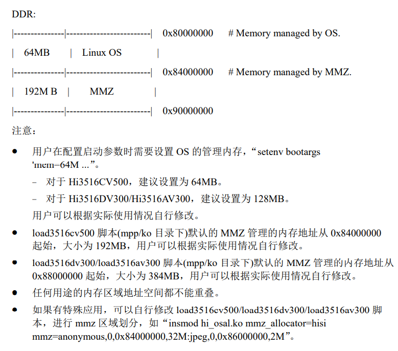

## 2. 通过`HiBurn`烧写

### 2.1 选择设备

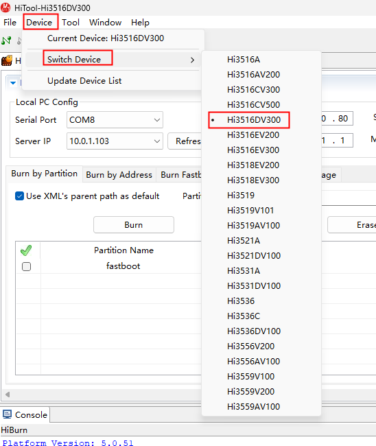

### 2.2 配置网络信息

1. 选择网络传输（USB 传输和串口传输速度很慢）
   
2. 选择相应串口和`tftp server`的 IP 地址，配置板端的网络信息
   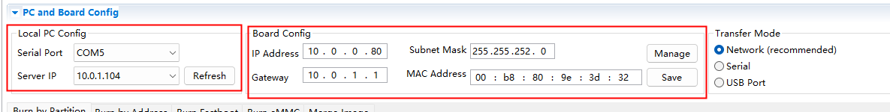

### 2.3 烧写步骤

#### 2.3.1 选择按分区烧写

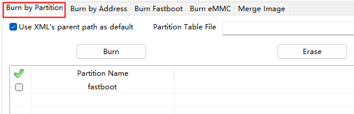

#### 2.3.2 配置分区信息和烧录

1. 添加分区

   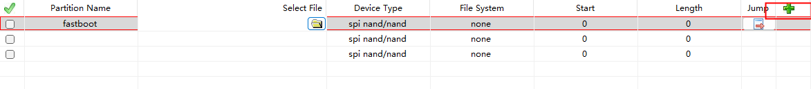

2. 选择各分区对应的文件

   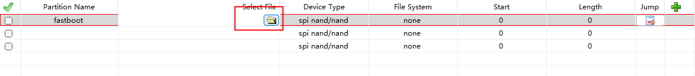

3. 选择和板子相匹配的设备类型（spi nand 或者 spi nor 等）

   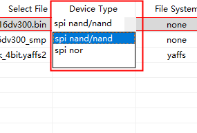

4. 选择适配的文件系统类型

   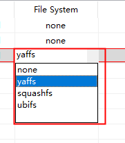

5. 配置正确的文件长度

   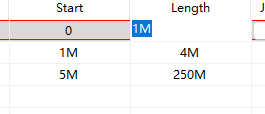

6. 勾选需要烧录的内容（kernel，rootfs 等）

   

7. 点按**Burn(烧录)**

8. 断电重启

**NOTE:** 存储介质为`eMMC`的在标签页选择`Burn eMMC`，配置方式与上述内容相同。

### 2.4 保存和加载配置分区信息的 XML


配置完成的分区信息，可以通过`Partition Table File`一栏的的`Save`按钮，将配置信息保存至特定的 XML 文件中。

已保存至 XML 文件的分区信息，可以通过`Browse`按钮，索引文件并导入分区信息。

### 2.5 烧录 fastboot

**NOTE:** 裸板状态下需要先进行 u-boot 烧录。

1. 选择烧写方式及 flash 类型

   

2. 选择需要烧录的 u-boot 镜像文件

   

3. 点按`Burn`

4. 断电重启

## 3. 通过 U-boot 指令烧写

为方便参考，本节将按照不同存储介质进行小节区分

### 3.1 配置设备 IP，tftp server

```sh
# board ip
setenv ipaddr 10.0.0.208
# tftp server ip
setenv serverip 10.0.1.104
# MAC (can be unconfigured)
setenv ethaddr xx:xx:xx:xx:xx:xx
# netmask
setenv netmask 255.255.252.0
# gateway
setenv gatewayip 10.0.1.1
# test the connectivity of the network
ping 10.0.1.101
```

### 3.2 SPI nand Flash

#### 3.2.1 u-boot

```sh
mw.b 0x82000000 0xff 0x80000
tftp 0x82000000 u-boot-hi3516dv300.bin
nand erase 0x0 0x80000
nand write 0x82000000 0x0 0x80000
```

命令解释：

- `mw.b 0x82000000 0xff 0x80000`: 此命令将`0x80000`个值为`0xff`的字节写入内存地址`0x82000000`。此命令为在加载新文件之前擦除内存。已擦除内存的大小必须大于新文件的实际大小。
- `tftp 0x82000000 u-boot-hi3516dv300.bin`: 此命令将文件`u-boot-hi3516dv300.bin`从 TFTP 服务器下载到内存地址`0x8200000`。此文件是设备的`U-boot`镜像文件。
- `nand erase 0x0 0x80000`: 此命令擦除 NAND flash 中从地址`0x0`开始的`0x80000`个字节的空间。此命令的目的是为在 NAND flash 中开辟存储`U-boot`镜像文件的空间
- `nand write 0x82000000 0x0 0x80000`: 此命令将`0x80000`个字节的数据从内存地址`0x82000000`写入 NAND flash 地址`0x0`。此命令为了将新的`U-boot`镜像文件写入 NAND flash。

#### 3.2.2 kernel

```sh
mw.b 0x82000000 0xff 0x400000
tftp 0x82000000 uImage_hi3516dv300_smp
nand erase 0x100000 0x400000
nand write 0x82000000 0x100000 0x400000
```

命令解释：

- `nand erase 0x100000 0x400000`: 此命令擦除 NAND flash 中从地址`0x100000`开始的`0x400000`个字节（4M Bytes）的空间。

- `nand write 0x82000000 0x100000 0x400000`: 此命令将`0x400000`个字节的数据从内存地址`0x82000000`写入 NAND flash 地址`0x100000`

#### 3.2.3 rootfs

```sh
mw.b 0x82000000 0xff 0x2000000
tftp 0x82000000 rootfs_hi3516dv300_2k_4bit.yaffs2
nand erase 0x500000 0xfa00000
nand write.yaffs 0x82000000 0x500000 0x11cc100
```

命令解释：

- `nand write.yaffs`: 此命令将写入 Yaffs 文件系统镜像，从内存地址`0x82000000`写入`0x11cc100`个字节数据到 NAND flash 地址`0x500000`

- `0x11cc100`: 表示文件系统镜像文件的实际大小（十六进制）。在使用 tftp 完成文件传输时，终端将提示已传输的字节数量

#### 3.2.4 地址计算

烧写命令中的地址偏移量需要精确计算。上述例子中，`U-boot`在烧录时仅仅占用`0x80000`个字节，但是在烧录 kernel 时却以`0x100000`个字节进行偏移，在烧录 rootfs 时计算的总偏移量就是`0x500000`($0x10000 + 0x400000 = 0x500000$)

---

### 3.3 SPI nor Flash

**TIP:** 本小节中使用的 DDR 起始地址参考了 hi3516ev300 设备的 DDR 起始地址

#### 3.3.1 u-boot

```sh
mw.b 0x42000000 0xff 0x80000
tftp 0x42000000 u-boot-hi3516ev300.bin
sf probe 0x0;sf erase 0x0 0x80000;sf write 0x42000000 0x0 0x80000
```

#### 3.3.2 kernel

```sh
mw.b 0x42000000 0xff 0x400000
tftp 0x42000000 uImage_hi3516ev300
sf probe 0x0;sf erase 0x100000 0x400000;sf write 0x42000000 0x100000 0x400000
```

#### 3.3.3 rootfs

```sh
mw.b 0x42000000 0xff 0xb00000
tftp 0x42000000 rootfs_hi3516ev300_64k.jffs2
sf probe 0x0;sf erase 0x500000 0xb00000;sf write 0x42000000 0x500000 0xb00000
```

### 3.4 eMMC

#### 3.4.1 eMMC 分区

eMMC 标准中，将内部的 Flash Memory 划分为 4 类区域，最多可以支持 8 个硬件分区，如下图所示：

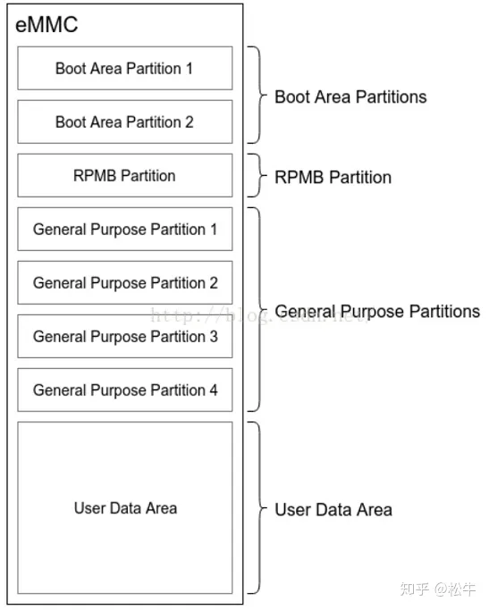

eMMC 设备烧录分区信息表：

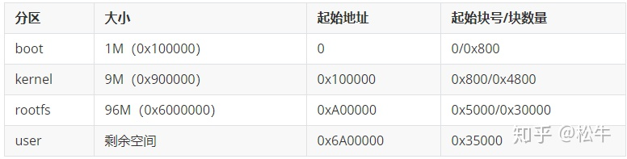

#### 3.4.2 u-boot

```shell
mw.b 0x82000000 0xff 0x80000
tftp 0x82000000 u-boot-hi3516dv300.bin
mmc write 0x0 0x82000000 0x0 0x800
```

**NOTE:** `0x800`表示`1M Bytes`所占有的 block 数量($0x100000 \div 0x200 = 0x800$)

#### 3.4.3 kernel

```shell
mw.b 0x82000000 0xff 0x400000
tftp 0x82000000 uImage_emmc
mmc write 0x0 0x82000000 0x800 0x2000
```

**NOTE:** `0x2000`表示`4M Bytes`所占有的 block 数量

#### 3.4.4 rootfs

```shell
# 7G
mw.b 0x82000000 0xff 0x9000000
tftp 0x82000000 rootfs_emmc.ext4
mmc write.ext4sp 0x0 0x82000000 0x2800 0xE00000

# 1G
mw.b 0x82000000 0xff 0x2400000
tftp 0x82000000 rootfs_emmc_1g.ext4
mmc write.ext4sp 0x0 0x82000000 0x2800 0x200000
```

**NOTE:** `0xE00000`表示内存大小所需要的 block 数量(block 数量依设备而定，在 8 号套件上 1 block 大小为 512 Bytes，即 0x200 Bytes，$0x1 C000 0000 \div 0x200 = 0xE0 0000$)

## 4. 配置启动参数

**NOTE:** linux-4.9.y kernel 默认文件系统只读，需要在 bootargs 中加入 rw 选项，文件系统才可读写

`bootargs`中`mem`的数值为系统内存(Linux OS)的大小，需要与 load3516dv300 文件中的表示的`os_mem`相匹配

配置完启动参数后需要使用`saveenv`保存设定的环境变量，在使用`reset`重启设备

### 4.1 nand flash

```sh
setenv bootargs 'mem=256M console=ttyAMA0,115200 root=/dev/mtdblock2 rootfstype=yaffs2 rw mtdparts=hinand:1M(boot),4M(kernel),250M(rootfs)'
setenv bootcmd 'nand read 0x82000000 0x100000 0x400000;bootm 0x82000000'
saveenv
reset
```

### 4.2 nor flash

```sh
setenv bootargs 'mem=32M console=ttyAMA0,115200 root=/dev/mtdblock2 rootfstype=jffs2 rw mtdparts=hi_sfc:1M(boot),4M(kernel),11M(rootfs)'
setenv bootcmd 'sf probe 0;sf read 0x42000000 0x100000 0x400000;bootm 0x42000000'
saveenv
reset
```

### 4.3 eMMC

```sh
# 7G
setenv bootargs 'mem=256M console=ttyAMA0,115200 root=/dev/mmcblk0p3 rw rootfstype=ext4 rootwait blkdevparts=mmcblk0:1M(boot),4M(kernel),7168M(rootfs)'
setenv bootcmd 'mmc read 0 0x82000000 800 2000;bootm 0x82000000'
saveenv
reset

# 1G
setenv bootargs 'mem=256M console=ttyAMA0,115200 root=/dev/mmcblk0p3 rw rootfstype=ext4 rootwait blkdevparts=mmcblk0:1M(boot),4M(kernel),1024M(rootfs)'
setenv bootcmd 'mmc read 0 0x82000000 800 2000;bootm 0x82000000'
saveenv
reset
```

## 5. 修改 load 文件

```sh
mem_total=256                 # 256M, total mem
mem_start=0x80000000          # phy mem start
os_mem_size=128               # 128M, os mem
mmz_start=0x88000000;         # mmz start addr
mmz_size=128M;                # 128M, mmz size
```

**NOTE:** `load3516dv300`文件的作用是**为文件系统加载 SDK 提供的`.ko`文件**，不修改`load3516dv300`文件的情况下，可以以传递命令行参数的形式配置`mmz_size`和`mem_total`大小

```sh
./load3516dv300 -i -osmem 256 -total 1024
```

## 6. Reference

1. [Uboot 的 bootargs 引导参数说明](https://www.365seal.com/y/ABpkZMg6VM.html)
2. [U-Boot Quick Reference](https://www.nxp.com/docs/en/user-guide/MEDIA5200UBPG.pdf)
3. [海思芯片系统镜像烧写教程](https://zhuanlan.zhihu.com/p/71789194)
4. Release Doc/01.software/board/SDK 安装及升级使用说明.pdf
5. Release Doc/01.software/pc/HiTool/HiBurn 工具使用指南.pdf
6. [Hi3559AV100 制作 ext4 文件系统和烧录 emmc](https://blog.csdn.net/xclshwd/article/details/88013064)
